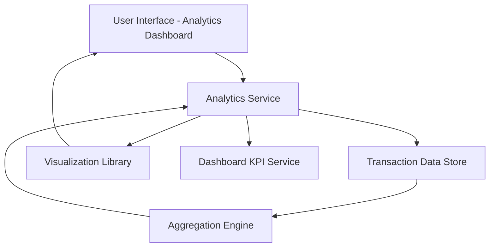

#### 1. High-Level Design

- **Summary:** This epic delivers interactive visualizations and analytical capabilities that help users understand spending patterns across nine predefined categories (Food & Dining, Fuel, Shopping, Travel, Entertainment, Utilities, Healthcare, Education, Miscellaneous). Users can analyze monthly spend trends, perform card-wise spend analysis, and view category-wise spending breakdowns to identify patterns and make data-driven financial decisions.

- **Component Flow:**

- **Integration Points:**
  - Upstream: Transaction data with accurate category tagging (from transaction management system)
  - Integration: Dashboard KPIs for consistent data representation
  - Downstream: Visualization library or charting service for rendering interactive charts

- **Key Assumptions:**
  - Transaction data includes pre-assigned categories matching the nine predefined categories; category assignment logic is handled upstream
  - Analytics aggregations are computed on-demand or via periodic batch jobs with results cached for near-real-time performance

- **NFR Highlights:** Visualizations must be interactive and responsive; Analytics must support real-time or near-real-time data updates; Charts must render efficiently across all device types

- **Data Flow:** User accesses the analytics dashboard UI and selects analysis parameters (time period, card, category). The Analytics Service retrieves categorized transaction data from the Transaction Data Store and passes it to the Aggregation Engine, which computes monthly trends, card-wise spend, and category-wise breakdowns. Aggregated data is formatted for visualization and passed to the Visualization Library, which renders interactive charts in the UI. The Analytics Service also synchronizes with the Dashboard KPI Service to ensure consistent data representation across the application.

#### 2. Validation Report

- **Requirements Coverage:** The design covers all scope items: monthly spend trends visualization, card-wise spend analysis, category-wise spending charts across nine categories, interactive visualizations, and spending pattern identification. The architecture supports NFRs for interactive and responsive visualizations, real-time or near-real-time data updates, and efficient chart rendering across device types. Integration points align with dependencies on categorized transaction data, dashboard KPI consistency, and visualization library usage.