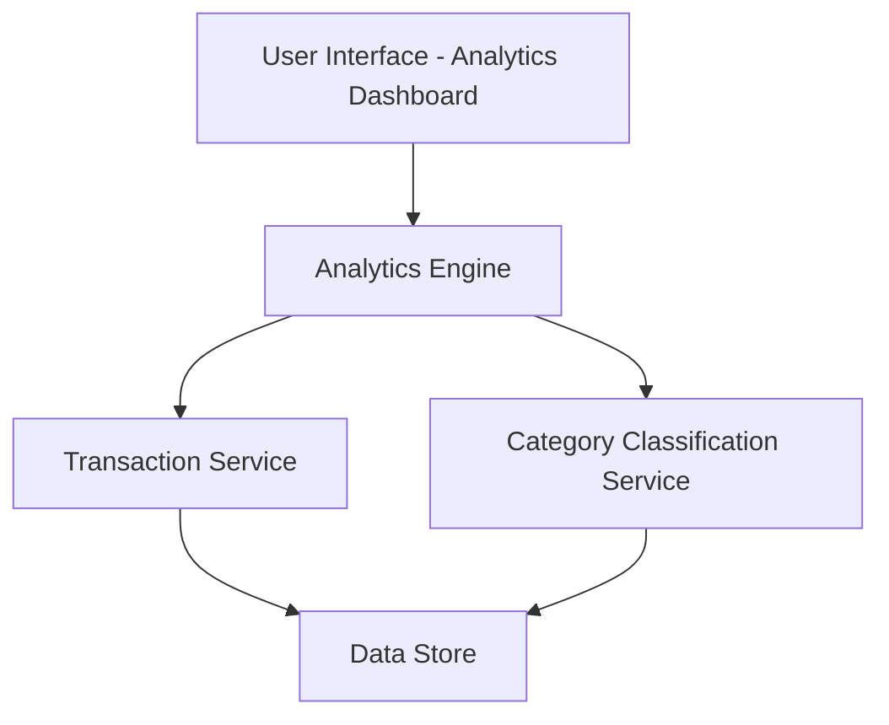

#### 1. High-Level Design

- **Summary:** This epic delivers an interactive analytics module that enables users to visualize and analyze their credit card spending patterns. The system provides category-wise spending breakdowns across nine categories (Food & Dining, Fuel, Shopping, Travel, Entertainment, Utilities, Healthcare, Education, Miscellaneous) and monthly trend analysis over at least 12 months of historical data. Users can interact with charts and graphs to identify spending habits and make data-driven financial decisions.

- **Component Flow:**

- **Integration Points:** 
  - **Upstream:** Transaction Service (provides transaction data), Category Classification Service (provides spending categorization)
  - **Downstream:** Analytics Engine (performs trend calculations and aggregations)

- **Key Assumptions:** 
  - Transaction data is pre-categorized by the Category Classification Service before being consumed by the Analytics Engine
  - Monthly aggregations are pre-computed or cached to meet the 3-second rendering requirement

- **NFR Highlights:** Analytics visualizations must render within 3 seconds; system must handle historical data for at least 12 months; charts must be interactive and support filtering

- **Data Flow:** User requests analytics from the dashboard → Analytics Engine retrieves transaction data from Transaction Service → Category Classification Service provides categorization metadata → Analytics Engine aggregates and computes trends → Interactive charts and graphs are rendered in the UI with category-wise spending and monthly trends → User can filter and interact with visualizations to explore spending patterns

#### 2. Validation Report

- **Requirements Coverage:** The design fully covers the epic's stated scope including category-wise spending visualization, monthly spend trends analysis, interactive charts and graphs, spending pattern identification, and support for nine spending categories. All NFRs (3-second render time, 12-month historical data, interactive filtering) are addressed through the architecture. Dependencies on Transaction Service, Category Classification Service, and Analytics Engine are properly mapped in the component flow.