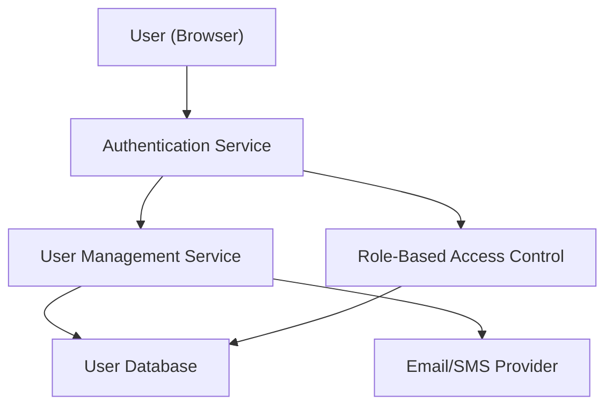

#### 1. High-Level Design

- **Summary:** This epic delivers a complete user lifecycle management system supporting secure registration, authentication, and role-based access control for three user types (consumers, sellers, administrators). It provides the foundation for personalized experiences and secure transactions across the platform.

- **Component Flow:**

- **Integration Points:**
  - Email/SMS notification providers for confirmation emails and password recovery
  - Cloud hosting services for user data storage
  - Optional third-party authentication services

- **Key Assumptions:**
  - User sessions will be managed via JWT tokens or similar stateless mechanism with configurable expiration times.
  - Role assignments (consumer, seller, admin) are determined at registration and can be modified by administrators post-registration.

- **NFR Highlights:** Support up to 100,000 concurrent users; all user data encrypted in transit and at rest; PCI DSS compliance; WCAG 2.1 AA accessibility; 99.9% uptime SLA; account lockout for suspicious activity.

- **Data Flow:** Users submit registration data via web forms → Authentication Service validates and creates user records → User Management Service stores encrypted credentials in User Database → Email/SMS Provider sends verification emails → Upon login, Authentication Service validates credentials → RBAC module checks user role and permissions → Session token issued to user → All subsequent requests validated against role-based permissions.

#### 2. Validation Report

- **Requirements Coverage:** The design fully covers the epic's stated scope including user registration for buyers/sellers, authentication/login/logout, role-based access control, password management and recovery, email verification, account lockout, and user profile management. All NFRs (encryption, PCI DSS compliance, concurrent user support, accessibility, uptime SLA) are addressed through the architecture components. Integration dependencies with email/SMS providers and cloud hosting are incorporated.