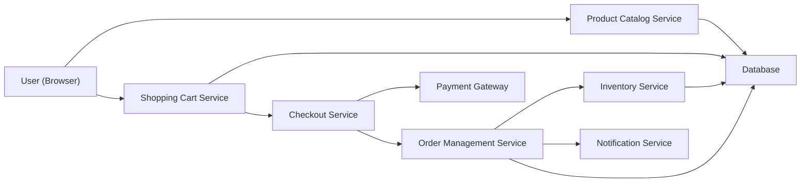

#### 1. High-Level Design

- **Summary:** This epic delivers the core transactional capabilities of the online shopping platform, enabling consumers to discover products through advanced search/filtering, manage shopping carts, complete secure checkouts with multiple payment methods, and track orders. Sellers can list products, manage inventory, and track sales.

- **Component Flow:**

- **Integration Points:**
  - Third-party payment gateway APIs for payment processing
  - Cloud hosting and CDN services for product images and content delivery
  - Email/SMS notification providers for order confirmations and updates
  - Third-party logistics APIs for automatic shipping updates

- **Key Assumptions:**
  - Product catalog supports standard product attributes (title, description, price, images, category) with extensible metadata fields.
  - Inventory updates occur in near real-time with eventual consistency acceptable for non-critical stock level displays.

- **NFR Highlights:** Page load times ≤2 seconds for 95% of requests; checkout completion within 5 seconds; support 10,000 transactions per minute with horizontal scaling; all transactions encrypted; PCI DSS compliance; fraud detection; WCAG 2.1 AA accessibility.

- **Data Flow:** Users search/filter products → Product Catalog Service queries Database and returns results → Users add items to cart → Shopping Cart Service maintains session state → Users proceed to checkout → Checkout Service validates cart and initiates payment → Payment Gateway processes transaction securely → Order Management Service creates order record → Inventory Service updates stock levels → Notification Service sends order confirmation via Email/SMS → Order tracking updates flow from logistics APIs to Order Management Service to user interface.

#### 2. Validation Report

- **Requirements Coverage:** The design comprehensively covers all scope elements including product catalog with search/filter, shopping cart management, secure checkout workflow, payment integration, order tracking, product listing for sellers, inventory management, reviews/ratings, order cancellation/refunds, and wishlist functionality. All NFRs (performance targets, transaction throughput, encryption, PCI DSS, fraud detection, accessibility) are addressed through dedicated services and integrations. All stated dependencies are incorporated into the architecture.