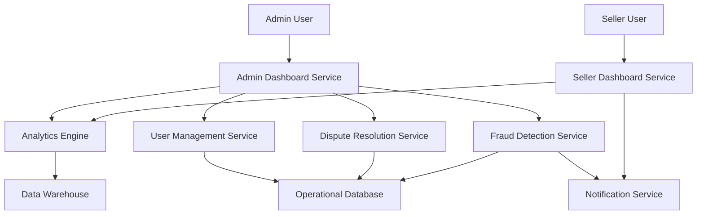

#### 1. High-Level Design

- **Summary:** This epic provides comprehensive administrative tools and analytics for platform administrators and sellers to monitor, manage, and optimize the platform. It includes admin dashboards with platform-wide analytics, user management, dispute resolution, fraud detection, and seller dashboards with sales analytics, inventory alerts, and performance metrics.

- **Component Flow:**

- **Integration Points:**
  - Cloud hosting services for analytics data storage and processing
  - Email/SMS notification providers for inventory alerts and administrative notifications
  - Optional third-party fraud detection services
  - Compliance monitoring tools for regulatory adherence

- **Key Assumptions:**
  - Analytics data is aggregated in batch or near real-time with acceptable latency of 5-15 minutes for non-critical metrics.
  - Fraud detection rules are configurable by administrators with both automated and manual review workflows.

- **NFR Highlights:** Support monitoring of up to 100,000 concurrent users; fraud detection processes transactions in real-time; automated failover and backup mechanisms; recovery from critical failures within 30 minutes; 99.9% uptime SLA; all administrative actions logged and auditable; comply with regional data privacy laws.

- **Data Flow:** Platform operational data continuously flows to Data Warehouse → Analytics Engine processes and aggregates metrics → Admin Dashboard Service queries analytics for platform-wide KPIs (user activity, transaction patterns, platform health) → User Management Service handles permissions and user actions → Dispute Resolution Service manages workflow states and case assignments → Fraud Detection Service analyzes transactions in real-time, flags suspicious activity → Notification Service alerts administrators → Seller Dashboard Service queries analytics for seller-specific metrics (sales trends, inventory levels, performance) → Notification Service sends inventory alerts to sellers → All administrative actions logged to audit trail in Operational Database.

#### 2. Validation Report

- **Requirements Coverage:** The design fully addresses the epic scope including admin dashboard with platform analytics, user management and permissions, dispute resolution workflows, fraud detection and account verification, seller dashboard with sales analytics, inventory alerts, platform health monitoring, compliance reporting, performance metrics/KPIs tracking, and manual review capabilities. All NFRs (concurrent user monitoring, real-time fraud detection, automated failover, recovery time, uptime SLA, audit logging, data privacy compliance) are incorporated through dedicated services and infrastructure components. All dependencies are integrated into the architecture.