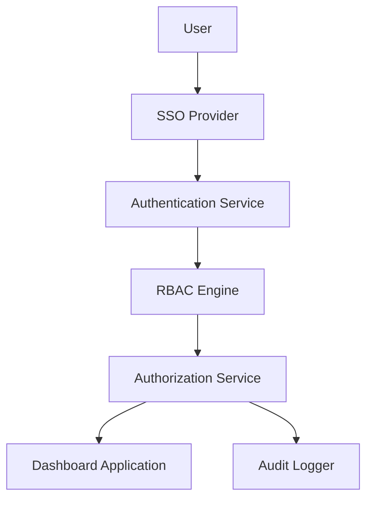

#### 1. High-Level Design

- **Summary**: This epic implements a comprehensive security framework featuring role-based access control (RBAC), SSO integration, data isolation, and audit logging. Enterprise Admins can manage user permissions, assign company access, and monitor security events. The system ensures strict data segregation and compliance with security standards while supporting 1,000 concurrent users.

- **Component Flow**:

- **Integration Points**: 
  - Upstream: Existing SSO provider for enterprise authentication
  - Downstream: Cloud provider security APIs for secure credential management, user authentication service, audit logging system

- **Key Assumptions**: 
  - Organization already has an SSO provider (e.g., Okta, Azure AD) that supports SAML 2.0 or OAuth 2.0
  - User role definitions and permission matrices will be defined during implementation based on organizational structure

- **NFR Highlights**: All data encrypted with TLS 1.2+ in transit and AES-256 at rest; system must support 1,000 concurrent users; unauthorized access attempts logged; user lockout recovery emails sent within 2 minutes; WCAG 2.1 AA accessibility compliance

- **Data Flow**: Users authenticate via SSO Provider, which validates credentials and returns identity tokens to the Authentication Service. The RBAC Engine evaluates user roles and company assignments. The Authorization Service enforces data isolation by filtering queries based on permissions. All access attempts and permission changes are logged by the Audit Logger. Authorized requests proceed to the Dashboard Application, which displays only permitted company data.

#### 2. Validation Report

- **Requirements Coverage**: The design comprehensively addresses all scope items including RBAC implementation, user permission management, SSO integration, audit logging, user lockout/recovery, data isolation, and security monitoring. All NFRs are covered including encryption standards, concurrent user support, audit requirements, and accessibility standards. The architecture ensures data security and compliance through layered security controls.