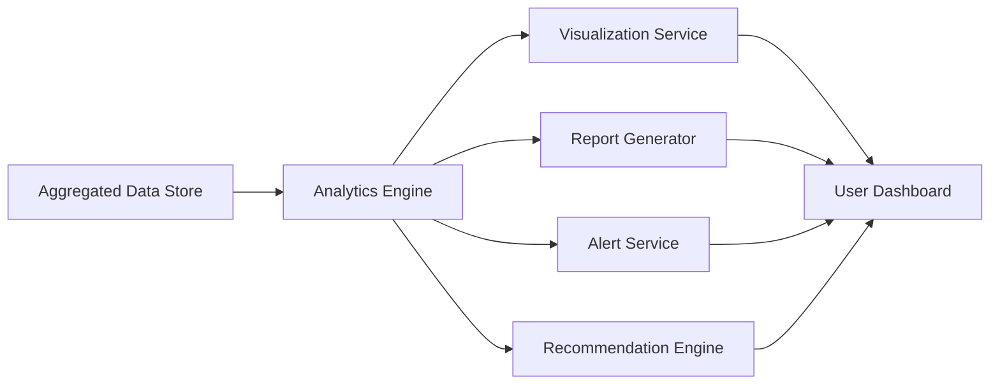

#### 1. High-Level Design

- **Summary**: This epic delivers a comprehensive analytics and reporting platform that transforms aggregated AI usage data into actionable insights. The system provides customizable dashboards, drill-down analytics, cross-company benchmarking, automated budget alerts, multi-format report exports, and AI-driven cost optimization recommendations for portfolio management decision-making.

- **Component Flow**:

- **Integration Points**: 
  - Upstream: Aggregated data from cloud provider integrations (Epic QE-4709), user management and RBAC system (Epic QE-4710), industry benchmark data sources
  - Downstream: Notification service for budget threshold alerts, export service for PDF/Excel generation

- **Key Assumptions**: 
  - Industry benchmark data is available from third-party providers or will be manually curated initially
  - Budget thresholds are configurable per company and will be set by Enterprise Admins during onboarding

- **NFR Highlights**: Dashboard pages load within 3 seconds for 95% of interactions; reports generated within 10 seconds; budget alerts sent within 5 minutes of threshold breach; supports visualization for up to 50 portfolio companies; WCAG 2.1 AA accessibility compliance

- **Data Flow**: The Analytics Engine queries the Aggregated Data Store to compute metrics, trends, and comparative benchmarks. The Visualization Service renders customizable widgets and charts for the User Dashboard. When users request reports, the Report Generator formats data into PDF or Excel files. The Alert Service continuously monitors budget thresholds and triggers notifications via the notification service when breaches occur. The Recommendation Engine applies AI algorithms to identify cost optimization opportunities and presents actionable suggestions on the dashboard.

#### 2. Validation Report

- **Requirements Coverage**: The design fully addresses the epic's scope including consolidated dashboards, customizable widgets, drill-down analytics, benchmarking tools, automated alerts, report exports in PDF/Excel, executive summaries, AI-driven recommendations, and cost simulation scenarios. All NFRs are covered including performance targets (3-second load, 10-second reports, 5-minute alerts), scale requirements (50 companies), and accessibility standards. The architecture enables data-driven decision-making through comprehensive analytics capabilities.