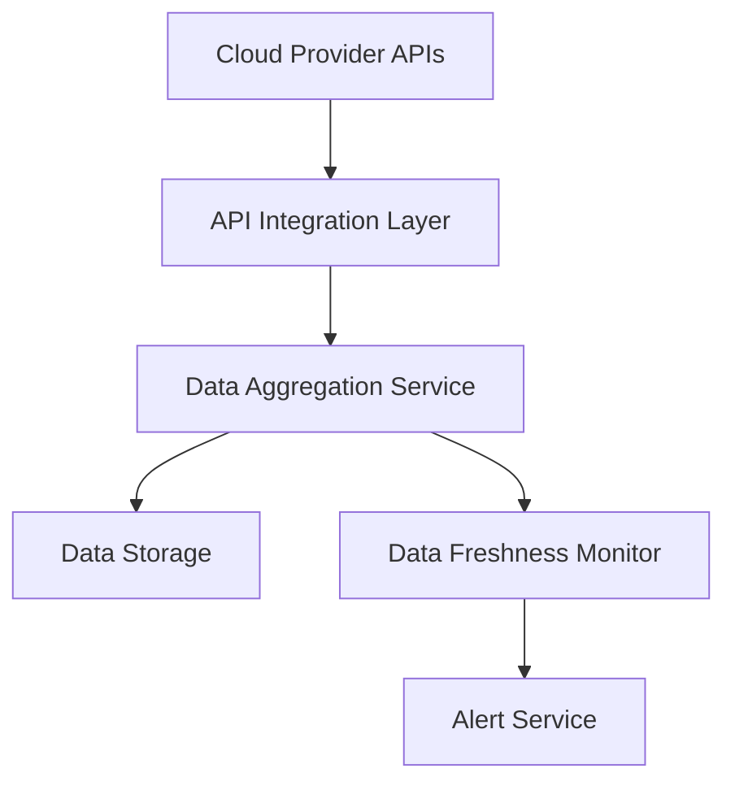

#### 1. High-Level Design

- **Summary:** This epic establishes automated data integration with major cloud providers (AWS, Azure, GCP) to aggregate AI usage and spend data from up to 50 portfolio companies in real-time. The system collects, synchronizes, and monitors data freshness, providing the foundational data layer for all dashboard analytics and reporting capabilities.

- **Component Flow:**

- **Integration Points:** 
  - Upstream: AWS, Azure, and GCP cloud provider APIs for AI service usage and spend data
  - Downstream: Provides aggregated data to Portfolio Analytics and Reporting epic (QE-4713)
  - Lateral: SSO provider for authentication; Portfolio companies must enable cloud provider integrations

- **Key Assumptions:** 
  - Cloud provider APIs return standardized JSON/XML responses with consistent schema for AI service metrics
  - Portfolio companies have granted necessary API access permissions and credentials are securely stored in a secrets management system

- **NFR Highlights:** Dashboard pages must load within 3 seconds for 95% of interactions; support up to 200 portfolio companies and 1,000 concurrent users; all data encrypted using TLS 1.2+ and AES-256; 99.5% uptime with automated failover; 95% of portfolio data updated within last 24 hours.

- **Data Flow:** Cloud provider APIs expose AI usage and spend metrics → API Integration Layer authenticates and retrieves data via secure REST/SDK calls → Data Aggregation Service normalizes, validates, and consolidates data from multiple providers → Aggregated data is encrypted and stored in Data Storage → Data Freshness Monitor tracks last update timestamps and triggers Alert Service when data is stale or missing → Dashboard and reporting components consume aggregated data for visualization.

#### 2. Validation Report

- **Requirements Coverage:** The design fully covers the epic's stated scope including integration with AWS/Azure/GCP, automated data collection and synchronization, data freshness monitoring, missing data alerts, support for 50 portfolio companies, and data encryption. All NFRs (load time, scale, encryption, uptime, data freshness) are addressed through appropriate architectural components. Dependencies on cloud provider APIs, portfolio company integrations, and SSO are acknowledged and incorporated.