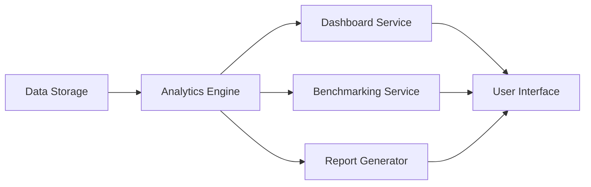

#### 1. High-Level Design

- **Summary:** This epic delivers comprehensive analytics, visualization, and reporting capabilities enabling stakeholders to monitor AI adoption, identify cost-saving opportunities, and benchmark performance across portfolio companies. Features include real-time consolidated dashboards, drill-down analytics, customizable widgets, benchmarking tools, AI-driven cost optimization recommendations, and report generation in PDF/Excel formats.

- **Component Flow:**

- **Integration Points:** 
  - Upstream: Relies on AI Data Integration and Aggregation epic (QE-4712) for data availability
  - Upstream: Requires User Management and Security epic (QE-4714) for role-based data access and permissions
  - Downstream: Export functionality delivers reports to external consumers (board meetings, investor updates)

- **Key Assumptions:** 
  - Industry benchmark data is available from third-party data providers or calculated from anonymized portfolio aggregate metrics
  - AI-driven cost optimization recommendations use rule-based algorithms or pre-trained ML models that don't require custom model training

- **NFR Highlights:** Dashboard pages must load within 3 seconds for 95% of user interactions with data from up to 50 portfolio companies; support 1,000 concurrent users without performance degradation; meet WCAG 2.1 AA accessibility standards including keyboard navigation and screen reader compatibility.

- **Data Flow:** Aggregated AI usage and spend data from Data Storage → Analytics Engine processes data to calculate KPIs, trends, and benchmarks → Dashboard Service renders real-time visualizations with drill-down capabilities → Benchmarking Service compares company metrics against portfolio averages and industry standards → Report Generator creates PDF/Excel exports with executive summaries and detailed analytics → User Interface presents all insights through customizable widgets with role-based filtering applied by User Management system.

#### 2. Validation Report

- **Requirements Coverage:** The design comprehensively covers all stated scope including consolidated real-time dashboards, drill-down analytics by department/project, customizable widgets, benchmarking tools, report generation in PDF/Excel, AI-driven cost optimization recommendations, and executive summary reports. All NFRs (3-second load time, 1,000 concurrent users, WCAG 2.1 AA accessibility) are addressed. Dependencies on QE-4712 for data and QE-4714 for access control are explicitly incorporated. Out-of-scope items (AI model management, non-USD currencies, non-English language support) are acknowledged and excluded.