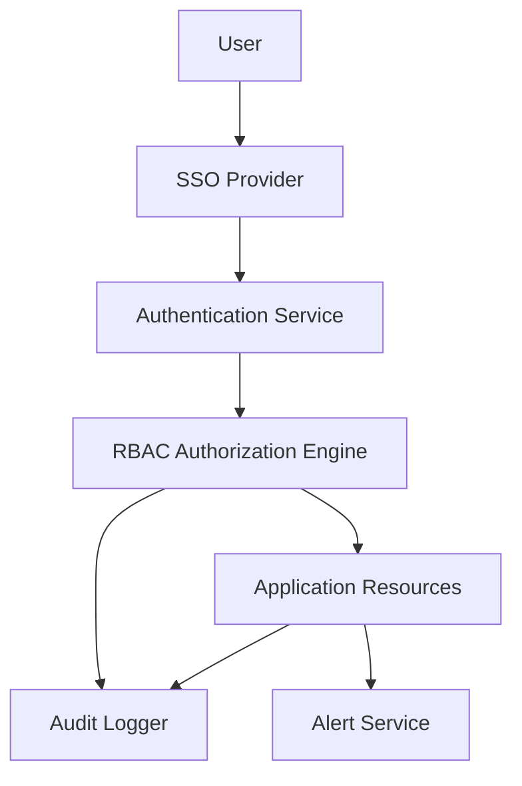

#### 1. High-Level Design

- **Summary:** This epic establishes robust security and access control mechanisms to protect sensitive portfolio company data while enabling appropriate stakeholder access. The system implements role-based access control (RBAC), SSO integration, audit logging, automated budget threshold alerts, and user lockout/recovery mechanisms, ensuring compliance with industry security standards.

- **Component Flow:**

- **Integration Points:** 
  - Upstream: SSO provider for user authentication (external identity provider)
  - Upstream: Cloud provider APIs for budget and spend data to trigger threshold alerts
  - Upstream: Email service for alert notifications and user recovery communications
  - Downstream: Provides authentication and authorization services to all other epics (QE-4712, QE-4713)

- **Key Assumptions:** 
  - SSO provider supports SAML 2.0 or OAuth 2.0/OIDC protocols for enterprise authentication
  - Budget threshold values are configurable per portfolio company and stored in system configuration with default alert levels (e.g., 80%, 90%, 100% of budget)

- **NFR Highlights:** All data in transit and at rest encrypted using TLS 1.2+ and AES-256; role-based access control and audit logging mandatory; support 1,000 concurrent users; 99.5% uptime with automated failover and daily data backups; alerts sent within 5 minutes of threshold breach; user lockout recovery emails sent within 2 minutes.

- **Data Flow:** User initiates login → SSO Provider authenticates user credentials → Authentication Service validates SSO token and creates session → RBAC Authorization Engine checks user roles and company-level permissions → User accesses Application Resources based on granted permissions → All access attempts and security events logged by Audit Logger → Budget monitoring detects threshold breaches and triggers Alert Service → Alert Service sends email notifications to Operating Partners within 5 minutes → User lockout events trigger recovery emails within 2 minutes via Email Service.

#### 2. Validation Report

- **Requirements Coverage:** The design fully addresses the epic's scope including RBAC with user and company-level permissions, SSO integration, audit logging of access attempts and security events, automated alerts for AI budget threshold breaches, user lockout and recovery mechanisms, permission assignment/revocation by Enterprise Admins, and unauthorized access prevention. All NFRs (encryption standards, concurrent user support, uptime, alert timing) are incorporated. Dependencies on SSO provider, cloud provider APIs, and email service are acknowledged. Out-of-scope items (custom authentication beyond SSO, manual provisioning, custom security protocols) are excluded as specified.