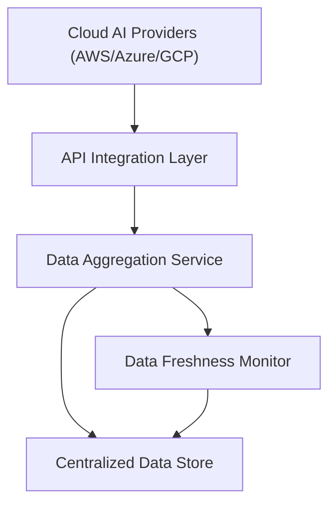

#### 1. High-Level Design

- **Summary:** This epic establishes the foundational data integration layer that connects to AWS, Azure, and GCP AI services to collect, aggregate, and synchronize AI usage and spend data from up to 50 portfolio companies. The system provides automated data ingestion with real-time synchronization and freshness monitoring to ensure stakeholders have accurate, up-to-date visibility into AI technology adoption and costs across the portfolio.

- **Component Flow:**

- **Integration Points:** 
  - Upstream: AWS AI services API, Azure AI services API, GCP AI services API
  - Downstream: Centralized data store that feeds the Dashboard Visualization epic (QE-4716)
  - Portfolio companies must enable cloud provider integrations to allow API access

- **Key Assumptions:** 
  - Portfolio companies have standardized API credentials and permission models across cloud providers
  - Data format from cloud providers follows documented API schemas with minimal transformation required

- **NFR Highlights:** Dashboard pages must load within 3 seconds for 95% of interactions; TLS 1.2+ and AES-256 encryption for data in transit and at rest; support up to 200 portfolio companies and 1,000 concurrent users; 99.5% uptime with automated failover; data updated within 24 hours with 95% compliance.

- **Data Flow:** Cloud AI providers expose usage and spend data via REST APIs. The API Integration Layer authenticates and retrieves data from each provider using secure credentials. The Data Aggregation Service normalizes and consolidates data from multiple sources, applying business rules and calculating portfolio-wide metrics. Aggregated data is stored in the Centralized Data Store with encryption at rest. The Data Freshness Monitor tracks ingestion timestamps and triggers notifications when data exceeds 24-hour staleness threshold.

#### 2. Validation Report

- **Requirements Coverage:** The design fully addresses the epic's core requirements including secure API integration with three major cloud providers, automated data aggregation, real-time synchronization, data freshness monitoring, and support for 50 portfolio companies in initial release. All specified NFRs (performance, encryption, scalability, uptime, data freshness) are incorporated into the architecture through dedicated components for monitoring, secure communication, and scalable data storage.