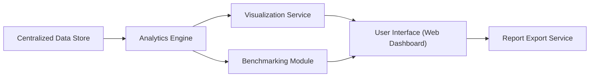

#### 1. High-Level Design

- **Summary:** This epic delivers the user-facing analytics and visualization layer that transforms aggregated AI data into actionable insights through customizable dashboards, benchmarking tools, drill-down analytics, and reporting capabilities. It enables Operating Partners and Deal Partners to monitor AI adoption, compare performance against industry benchmarks, identify trends and anomalies, and generate cost optimization recommendations across portfolio companies.

- **Component Flow:**

- **Integration Points:**
  - Upstream: Relies on Centralized Data Store populated by AI Data Integration and Aggregation epic (QE-4715)
  - External: Industry benchmark data sources for comparative analysis
  - Downstream: Report Export Service generates PDF and Excel outputs for external consumption

- **Key Assumptions:**
  - Industry benchmark data is available through third-party APIs or data feeds with standardized metrics
  - User preferences and dashboard configurations are stored per user profile with session persistence

- **NFR Highlights:** Dashboard must load within 3 seconds for 95% of user interactions even with data from 50 portfolio companies; must meet WCAG 2.1 AA accessibility standards including keyboard navigation and screen reader compatibility; system must support 1,000 concurrent users without performance degradation.

- **Data Flow:** The Analytics Engine queries the Centralized Data Store to retrieve aggregated AI usage and spend data, applying filters, aggregations, and calculations to generate metrics and trends. The Benchmarking Module enriches analytics with industry comparison data from external sources. The Visualization Service transforms processed data into charts, graphs, and widgets optimized for web rendering. The User Interface presents customizable dashboard views with drill-down capabilities, allowing users to navigate from portfolio-level summaries to company, department, or project details. The Report Export Service generates formatted PDF and Excel reports on demand for offline analysis and stakeholder distribution.

#### 2. Validation Report

- **Requirements Coverage:** The design comprehensively covers all stated requirements including consolidated real-time dashboard views, customizable widgets, benchmarking tools, drill-down analytics, data visualization, trend analysis, and report export functionality. The architecture addresses all NFRs through performance-optimized rendering (3-second load time), WCAG 2.1 AA accessibility compliance, and concurrent user support. The modular design separates analytics processing from visualization, enabling independent scaling and maintenance.