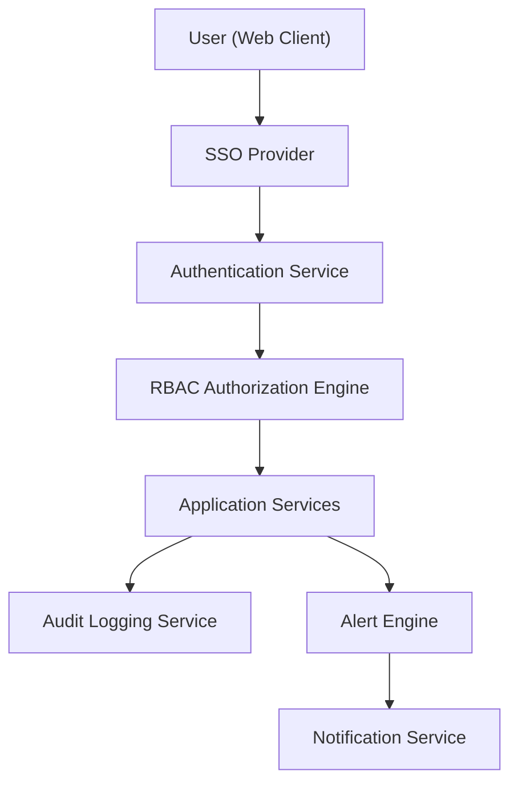

#### 1. High-Level Design

- **Summary:** This epic establishes the comprehensive security, access control, and proactive monitoring framework for the AI Portfolio Management Dashboard. It implements role-based access control (RBAC) with company-level permissions, SSO integration for authentication, audit logging for compliance, automated budget threshold alerts, and data quality notifications. Enterprise Admins manage user permissions and integrations while Operating Partners receive timely alerts for budget overruns and data quality issues.

- **Component Flow:**

- **Integration Points:**
  - Upstream: Existing SSO provider for user authentication and identity management
  - External: Email/notification service for alert delivery to users
  - Internal: User management service for permission controls and role assignment
  - Downstream: All application services (data integration, dashboard, analytics) enforce RBAC policies

- **Key Assumptions:**
  - SSO provider supports SAML 2.0 or OAuth 2.0 protocols with standard claim mappings
  - Alert thresholds for budget and data quality are configurable per portfolio company with default values

- **NFR Highlights:** All data in transit and at rest must be encrypted using TLS 1.2+ and AES-256; role-based access control and audit logging are mandatory; alerts must be sent within 5 minutes of threshold breach; system must achieve 99.5% uptime; must support 1,000 concurrent users.

- **Data Flow:** Users authenticate through the SSO Provider, which validates credentials and returns identity tokens to the Authentication Service. The RBAC Authorization Engine evaluates user roles and company-level permissions against requested resources, enforcing access policies before allowing operations. All user actions and data access events are captured by the Audit Logging Service for compliance and security analysis. The Alert Engine continuously monitors AI budget thresholds and data freshness metrics, triggering alerts when conditions are met. The Notification Service delivers alerts via email or other channels within 5 minutes of detection. Enterprise Admins use dedicated interfaces to configure integrations, assign user roles, set alert thresholds, and review audit logs.

#### 2. Validation Report

- **Requirements Coverage:** The design fully addresses all security, access control, and alerting requirements specified in the epic. RBAC with company-level permissions is implemented through the Authorization Engine, SSO integration provides centralized authentication, comprehensive audit logging captures all access and changes, and the Alert Engine with Notification Service delivers timely notifications for budget and data quality issues. All NFRs are incorporated including encryption standards, mandatory security controls, 5-minute alert SLA, uptime requirements, and concurrent user support. The architecture provides Enterprise Admins with full control over user management and permissions while ensuring Operating Partners receive proactive alerts for critical issues.