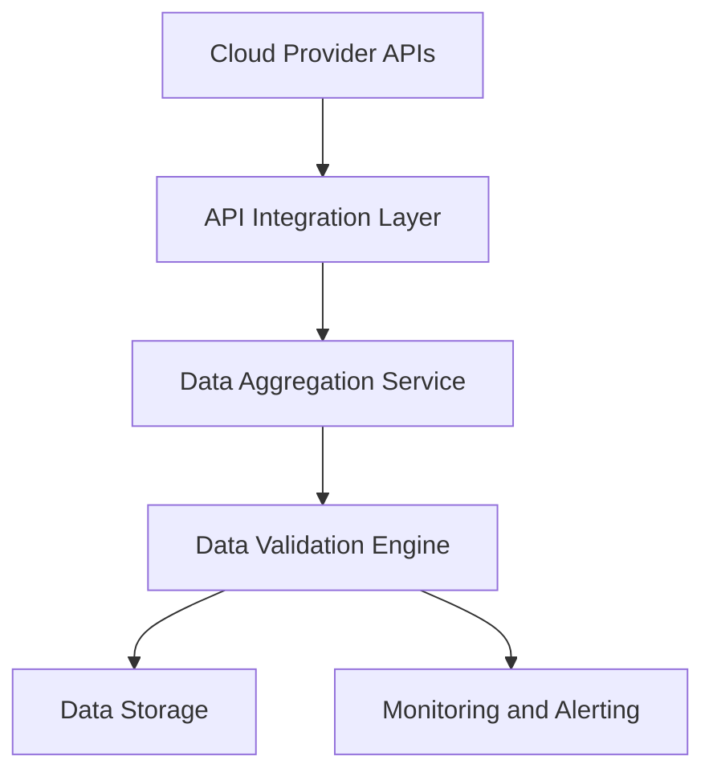

#### 1. High-Level Design

- **Summary**: This epic establishes the foundational data layer for an AI Portfolio Management Dashboard by automating the collection, aggregation, and synchronization of AI usage and spend data from AWS, Azure, and GCP across up to 50 portfolio companies. It ensures real-time visibility through secure API integrations, data validation, and freshness monitoring with automated alerts.

- **Component Flow**:

- **Integration Points**: 
  - Upstream: AWS AI services APIs, Azure AI services APIs, GCP AI services APIs
  - Downstream: Dashboard visualization layer (Epic QE-4719), portfolio companies' cloud provider access permissions
  - Supporting: API versioning and monitoring systems, data backup systems

- **Key Assumptions**: 
  - Portfolio companies will grant necessary API access permissions to their cloud provider accounts
  - Data format from cloud providers follows standard JSON/REST API patterns with consistent schema

- **NFR Highlights**: Dashboard load time ≤3s (95th percentile), support 200 companies and 1,000 concurrent users, TLS 1.2+ and AES-256 encryption, 99.5% uptime with automated failover, 95% data freshness within 24 hours, daily backups required

- **Data Flow**: Cloud provider APIs expose AI usage and spend metrics → API Integration Layer authenticates and fetches data via secure connections → Data Aggregation Service consolidates multi-cloud data into unified format → Data Validation Engine checks completeness, accuracy, and freshness → Valid data stored in encrypted database → Monitoring service tracks data staleness and triggers alerts when thresholds breached → Dashboard consumes aggregated data for visualization

#### 2. Validation Report

- **Requirements Coverage**: The design fully covers the epic's stated scope including multi-cloud API integration (AWS/Azure/GCP), automated data aggregation and synchronization, real-time freshness monitoring, staleness alerts, data validation and error handling, and support for 50 portfolio companies. All NFRs (performance, scalability, encryption, uptime, data freshness, backups) are addressed through appropriate architectural components. The design excludes out-of-scope items (on-premise platforms, niche AI providers, AI model management) as specified.