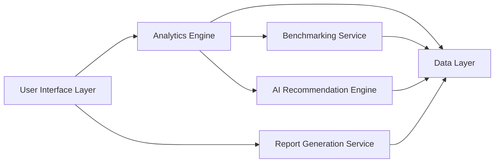

#### 1. High-Level Design

- **Summary**: This epic delivers a comprehensive dashboard interface that visualizes AI usage and spend data across the portfolio, providing consolidated views, customizable widgets, drill-down analytics, benchmarking tools, and AI-driven cost optimization recommendations. It serves multiple personas (Enterprise Admins, General Partners, Operating Partners) with tailored views to identify cost-saving opportunities and demonstrate AI ROI.

- **Component Flow**:

- **Integration Points**: 
  - Upstream: AI Data Integration and Aggregation epic (QE-4718) for underlying data layer
  - External: Industry benchmarking data sources
  - Supporting: Analytics and visualization libraries, report generation services (PDF/Excel export)

- **Key Assumptions**: 
  - Industry benchmarking data is available via third-party APIs or data feeds in compatible format
  - AI recommendation algorithms can be trained on historical portfolio data to generate actionable insights

- **NFR Highlights**: Dashboard load time ≤3s (95th percentile), WCAG 2.1 AA accessibility compliance (keyboard navigation, screen readers), support 1,000 concurrent users without degradation, report generation ≤10s

- **Data Flow**: Aggregated AI data from Epic QE-4718 flows into Data Layer → Analytics Engine processes data for trend analysis, cost patterns, and drill-down queries → Benchmarking Service compares portfolio company metrics against industry averages → AI Recommendation Engine analyzes usage patterns to identify optimization opportunities → User Interface Layer renders customizable widgets, charts, and personalized views → Report Generation Service exports data and visualizations to PDF/Excel formats → Users interact with dashboard to explore insights, simulate cost savings, and make data-driven decisions

#### 2. Validation Report

- **Requirements Coverage**: The design comprehensively covers the epic's scope including consolidated portfolio views, customizable widgets, drill-down analytics by department/project, benchmarking tools (cross-company and industry), AI-driven recommendations, cost savings simulations, report generation (PDF/Excel), and executive summary views. All NFRs are addressed: 3s load time, WCAG 2.1 AA accessibility, 1,000 concurrent user support, and 10s report generation. The design appropriately excludes out-of-scope items (custom AI development, model management interfaces, multi-language/multi-currency support in initial release).