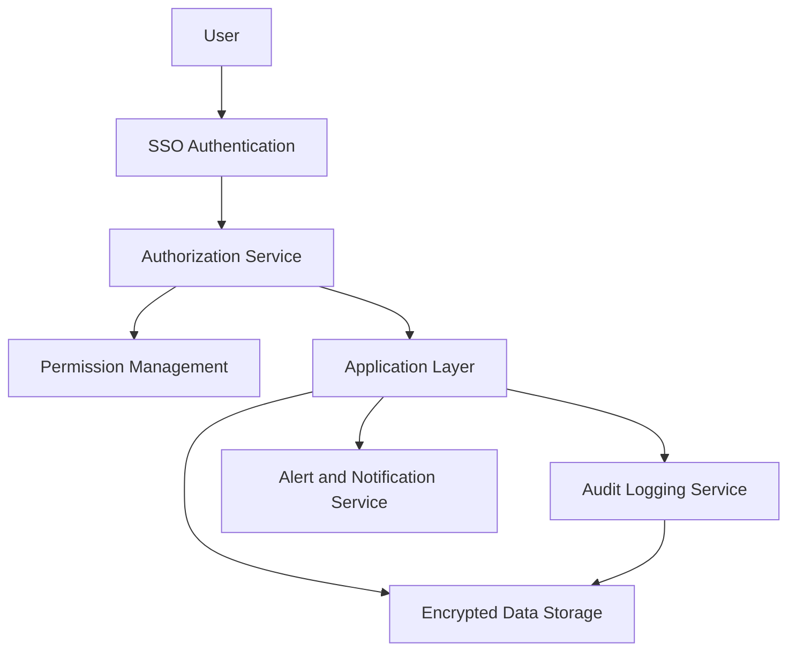

#### 1. High-Level Design

- **Summary**: This epic establishes a comprehensive security framework with role-based access control (RBAC) to protect sensitive portfolio company data while enabling appropriate access for authorized users. It includes SSO authentication, granular permission management, comprehensive audit logging, automated budget threshold alerting, and account recovery mechanisms to ensure compliance with data privacy requirements and build trust through strict data governance.

- **Component Flow**:

- **Integration Points**: 
  - Upstream: Existing SSO solutions for user authentication
  - External: Email service for alerts and notifications, encryption key management systems
  - Supporting: Audit log storage and monitoring systems

- **Key Assumptions**: 
  - Enterprise already has SSO infrastructure (e.g., Okta, Azure AD) that can be integrated via SAML/OAuth protocols
  - Budget thresholds are configurable per portfolio company and stored in system configuration

- **NFR Highlights**: TLS 1.2+ encryption in transit, AES-256 encryption at rest, mandatory RBAC and audit logging, alert delivery ≤5 minutes of threshold breach, password reset emails ≤2 minutes, 99.5% uptime, immediate logging of unauthorized access attempts

- **Data Flow**: User initiates login → SSO Authentication validates credentials against enterprise identity provider → Authorization Service retrieves user roles and company-level permissions → User accesses Application Layer based on granted permissions → All user actions logged by Audit Logging Service with timestamp, user ID, action type, and outcome → When budget thresholds breached, Alert and Notification Service triggers email to Operating Partners within 5 minutes → Enterprise Admins manage user permissions via Permission Management interface → All data encrypted in transit (TLS 1.2+) and at rest (AES-256) → Unauthorized access attempts immediately logged and flagged → Account recovery requests trigger password reset emails within 2 minutes

#### 2. Validation Report

- **Requirements Coverage**: The design fully addresses the epic's scope including RBAC with company-level permissions, SSO integration, user and permission management interface for Enterprise Admins, automated budget threshold alerts, comprehensive audit logging of actions and access attempts, user lockout and account recovery, data encryption (transit and rest), and access violation detection. All NFRs are covered: TLS 1.2+ and AES-256 encryption, mandatory RBAC and audit logging, 5-minute alert delivery, 2-minute password reset emails, 99.5% uptime, and immediate logging of unauthorized access. The design excludes out-of-scope items (custom SSO development, biometric authentication, advanced threat detection, DLP tools) as specified.