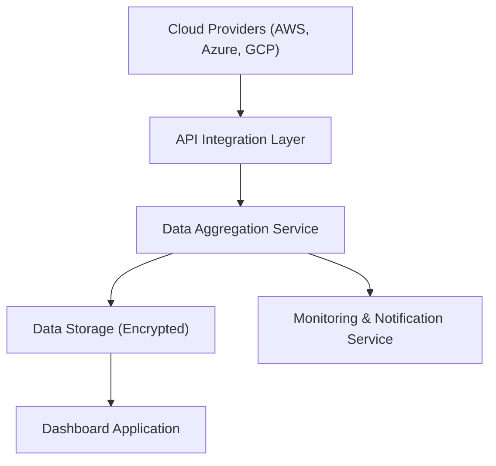

#### 1. High-Level Design

- **Summary:** This epic establishes automated integration with AWS, Azure, and GCP to aggregate AI usage and spend data from up to 50 portfolio companies in real-time. It provides secure API-based ingestion, data freshness monitoring, and automated notifications for missing or stale data (>24 hours old).

- **Component Flow:**

- **Integration Points:** 
  - Upstream: AWS, Azure, and GCP cloud provider APIs for AI service usage and cost data
  - Downstream: Dashboard application, SSO provider for authentication, notification service for alerting on data freshness issues

- **Key Assumptions:** 
  - Portfolio companies have already provisioned API credentials and granted necessary read permissions for their cloud AI services
  - Data format from cloud providers follows standard billing/usage APIs with consistent schema across providers

- **NFR Highlights:** Dashboard load time <3 seconds for 95% of interactions; 99.5% uptime with automated failover; encryption in transit (TLS 1.2+) and at rest (AES-256); support for 1,000 concurrent users and up to 200 portfolio companies; data refresh within 24 hours for 95% of companies.

- **Data Flow:** Cloud provider APIs expose AI usage and spend data → API Integration Layer authenticates and fetches data via secure connections → Data Aggregation Service normalizes, consolidates, and validates data from multiple sources → Aggregated data is encrypted and stored in the Data Storage layer → Monitoring Service checks data freshness and triggers notifications if data is >24 hours old → Dashboard Application queries the storage layer to present real-time portfolio-wide visibility to users.

#### 2. Validation Report

- **Requirements Coverage:** The design fully covers the epic's stated scope including secure API integration with AWS/Azure/GCP, automated data aggregation and synchronization, real-time consolidation, data freshness monitoring, and automated notifications. All NFRs (performance, encryption, uptime, scalability) are addressed through appropriate architectural components (encrypted storage, monitoring service, scalable integration layer). Dependencies on cloud provider APIs and SSO are acknowledged and integrated into the design.