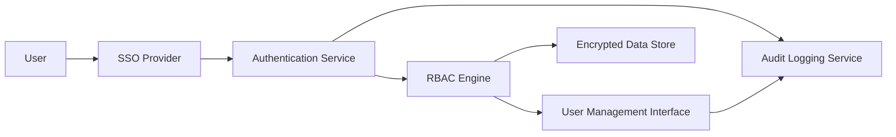

#### 1. High-Level Design

- **Summary:** This epic delivers comprehensive security and access management for the AI Portfolio Management Dashboard. Enterprise Admins can configure role-based access control (RBAC), manage user permissions by portfolio company, monitor security through audit logging, and handle user lockout recovery. The system ensures data protection through encryption, SSO integration, and compliance with security standards.

- **Component Flow:**

- **Integration Points:** 
  - Upstream: SSO provider for user authentication, existing identity management systems for user provisioning
  - Downstream: Notification service for security alerts and user lockout recovery emails, audit log storage and review systems

- **Key Assumptions:** 
  - SSO provider supports standard protocols (SAML 2.0 or OAuth 2.0) and can provide user identity claims for role mapping
  - Enterprise Admins have a predefined set of roles and permissions that map to portfolio company data boundaries

- **NFR Highlights:** All data encrypted in transit (TLS 1.2+) and at rest (AES-256); RBAC and audit logging mandatory; support for 1,000 concurrent users; unauthorized access attempts logged; lockout recovery emails within 2 minutes; WCAG 2.1 AA accessibility compliance.

- **Data Flow:** User attempts access → SSO Provider authenticates user and returns identity token → Authentication Service validates token and establishes session → RBAC Engine evaluates user roles and permissions against requested resources (portfolio company data) → Access granted/denied based on policy; all attempts logged to Audit Logging Service → Enterprise Admins use User Management Interface to configure roles, assign permissions, and review audit logs → Security alerts and lockout recovery notifications sent via email service → All sensitive data accessed through encrypted channels and stored in Encrypted Data Store.

#### 2. Validation Report

- **Requirements Coverage:** The design comprehensively addresses the epic's scope including RBAC configuration, user permission management, audit logging, SSO integration, user lockout recovery, and security alert notifications. All NFRs are satisfied: encryption standards (TLS 1.2+, AES-256), mandatory RBAC and audit logging, scalability (1,000 concurrent users), lockout recovery SLA (2 minutes), and WCAG 2.1 AA accessibility. Dependencies on SSO provider and identity management systems are incorporated into the authentication flow.