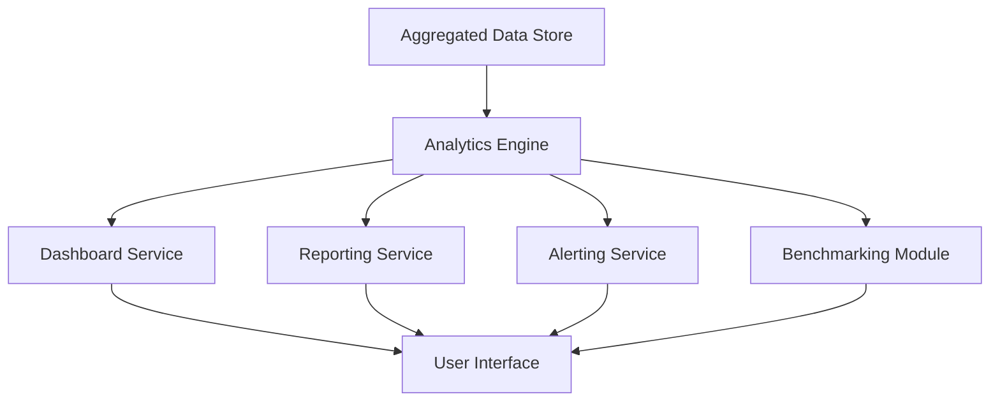

#### 1. High-Level Design

- **Summary:** This epic provides Operating Partners, Deal Partners, and General Partners with comprehensive analytics, reporting, and alerting capabilities. Users can view consolidated dashboards of AI usage and spend across portfolio companies, drill down by department or project, customize widgets, generate reports (PDF/Excel), receive automated budget alerts, and access benchmarking tools for cross-company and industry comparison.

- **Component Flow:**

- **Integration Points:** 
  - Upstream: Aggregated data from cloud provider integrations (AWS, Azure, GCP) via the Data Integration epic, user management system for personalized views and alert routing
  - Downstream: Email or notification service for alert delivery, export services for PDF and Excel report generation

- **Key Assumptions:** 
  - Budget thresholds are configurable per portfolio company and can be set at multiple levels (company, department, project)
  - Industry benchmark data is available from external sources or derived from anonymized portfolio data aggregates

- **NFR Highlights:** Dashboard load time <3 seconds for 95% of interactions with up to 50 portfolio companies; budget alerts within 5 minutes of threshold breach; report generation within 10 seconds; support for 1,000 concurrent users; WCAG 2.1 AA accessibility; 80% user adoption target among Operating Partners within 6 months.

- **Data Flow:** Aggregated Data Store (populated by integration epic) provides consolidated AI usage and spend data → Analytics Engine processes data for insights, trends, cost optimization recommendations, and benchmarking calculations → Dashboard Service renders real-time views with customizable widgets and drill-down capabilities → Reporting Service generates executive summaries and detailed reports in PDF/Excel formats on demand → Alerting Service continuously monitors budget thresholds and triggers notifications within 5 minutes of breach → Benchmarking Module compares company performance against portfolio peers and industry averages → All outputs presented through User Interface with personalized views and saved configurations.

#### 2. Validation Report

- **Requirements Coverage:** The design fully addresses the epic's scope including consolidated dashboards, drill-down analytics, customizable widgets, report generation (PDF/Excel), automated budget alerts, benchmarking tools, executive summaries, and cost optimization recommendations. All NFRs are met: performance targets (3-second load, 5-minute alerts, 10-second reports), scalability (1,000 concurrent users, 50 portfolio companies), accessibility (WCAG 2.1 AA), and adoption goals. Dependencies on aggregated cloud provider data, user management, and notification services are explicitly incorporated into the component architecture.