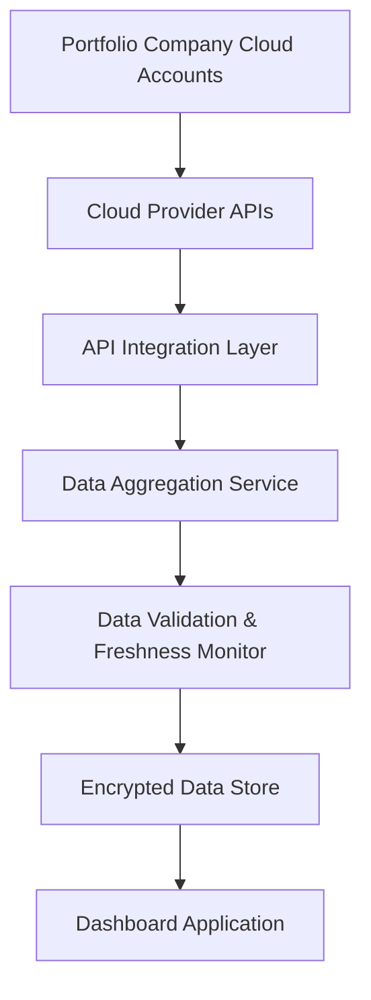

#### 1. High-Level Design

**Summary:** This epic establishes the foundational data layer for the AI Portfolio Management Dashboard by automating the collection and aggregation of AI usage and spend data from three major cloud providers (AWS, Azure, GCP) across all portfolio companies. The system provides real-time data synchronization, freshness monitoring, and secure encrypted data handling to enable accurate portfolio-wide visibility.

**Component Flow:**

**Integration Points:**
- **Upstream Systems:** AWS AI Services API, Azure AI Services API, GCP AI Services API
- **Downstream Systems:** Dashboard Application (for data consumption), SSO Provider (for authentication during API access)
- **External Dependencies:** Portfolio company cloud accounts must grant API access permissions

**Key Assumptions:**
- Portfolio companies will provide necessary API credentials and permissions within standard OAuth 2.0 or service account frameworks.
- AI usage data from cloud providers follows standardized billing and usage metrics formats (e.g., AWS Cost Explorer, Azure Cost Management, GCP Billing APIs).

**NFR Highlights:** System must support 200 portfolio companies and 1,000 concurrent users; 3-second dashboard load time; 99.5% uptime with automated failover; TLS 1.2+ and AES-256 encryption; 95% of data updated within 24 hours.

**Data Flow:** Portfolio company cloud accounts expose AI service usage and billing data through cloud provider APIs. The API Integration Layer authenticates securely and retrieves data in scheduled intervals (e.g., hourly or daily). The Data Aggregation Service normalizes data from different cloud providers into a unified schema. The Data Validation & Freshness Monitor checks for completeness, flags missing or stale data (>24 hours old), and triggers alerts. Validated data is encrypted and stored in the Data Store, where the Dashboard Application queries it for real-time visualization and reporting.

#### 2. Validation Report

**Requirements Coverage:** The high-level design fully addresses the epic's stated scope including secure API integration with AWS/Azure/GCP, automated data ingestion and synchronization, data freshness monitoring with alerts, encryption in transit and at rest, and scalability to support up to 200 portfolio companies. All non-functional requirements (performance, security, scalability, reliability) are incorporated into the architecture. The design provides the foundational data layer required for downstream analytics and reporting features as described in the epic's user value proposition.