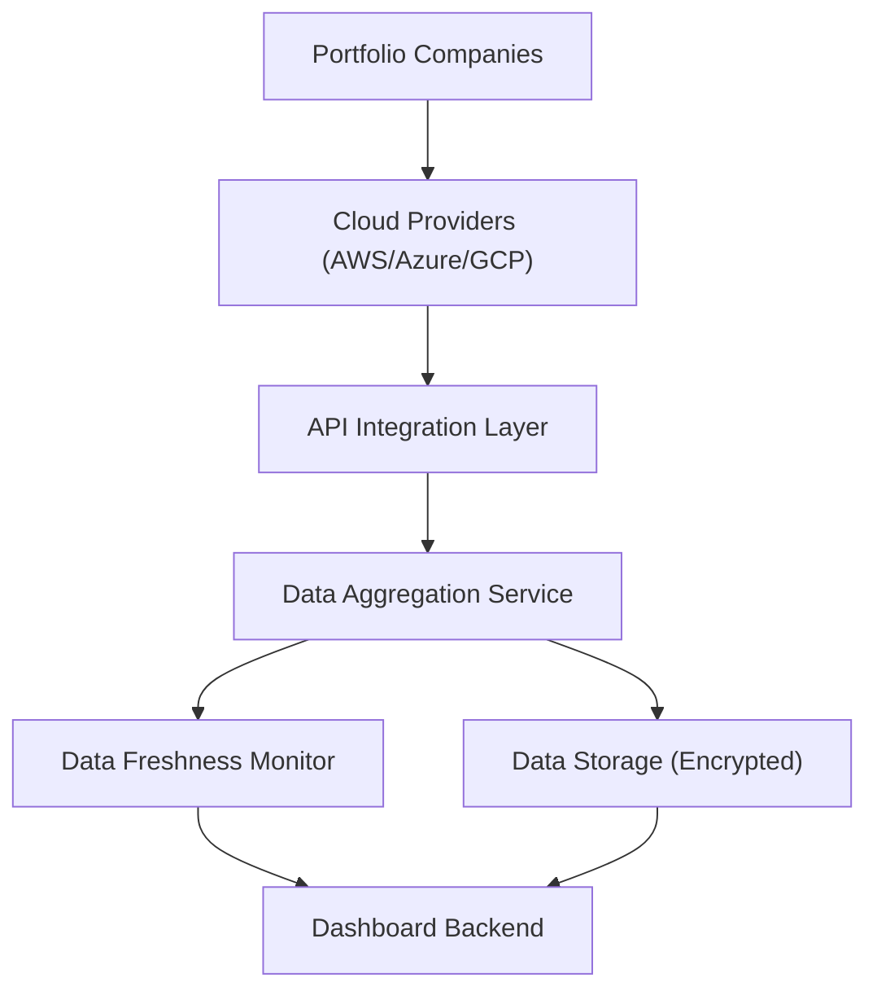

#### 1. High-Level Design

- **Summary**: This epic establishes the foundational data layer for an AI Portfolio Management Dashboard by automating the collection and aggregation of AI usage and spend data from three major cloud providers (AWS, Azure, GCP) across up to 50 portfolio companies. The system provides real-time synchronization, data freshness monitoring, and secure encrypted data handling to enable Operating Partners and stakeholders to gain accurate visibility into AI technology adoption and investments.

- **Component Flow**:

- **Integration Points**: 
  - **Upstream**: AWS, Azure, and GCP cloud provider APIs for AI service usage and billing data
  - **Downstream**: Dashboard backend services for analytics and reporting features; SSO provider for user authentication
  - **Internal**: Data freshness monitoring service alerts dashboard when data is missing or outdated beyond 24 hours

- **Key Assumptions**: 
  - Portfolio companies have already enabled appropriate API access permissions on their cloud provider accounts for data extraction
  - AI usage data from cloud providers follows standardized schema formats that can be normalized across AWS, Azure, and GCP

- **NFR Highlights**: System must achieve 99.5% uptime with automated failover, support 200 portfolio companies and 1,000 concurrent users, encrypt all data with TLS 1.2+ and AES-256, and maintain dashboard load times under 3 seconds for 95% of requests

- **Data Flow**: Cloud provider APIs expose AI service usage and billing data → API Integration Layer authenticates and fetches data via secure connections → Data Aggregation Service normalizes and consolidates multi-cloud data → Encrypted Data Storage persists aggregated records → Data Freshness Monitor tracks last update timestamps and triggers alerts if data exceeds 24-hour threshold → Dashboard Backend queries aggregated data to serve real-time views to authorized users

#### 2. Validation Report

- **Requirements Coverage**: The high-level design fully covers the epic's stated scope including secure API integration with AWS/Azure/GCP, automated data ingestion and synchronization, data freshness monitoring with notifications, support for up to 50 portfolio companies (scalable to 200), encryption in transit and at rest, and the foundational data layer required for downstream analytics. All specified NFRs (uptime, load time, encryption standards, scalability, data freshness) are addressed in the architecture through dedicated components (failover mechanisms, encrypted storage, freshness monitor, scalable aggregation service).