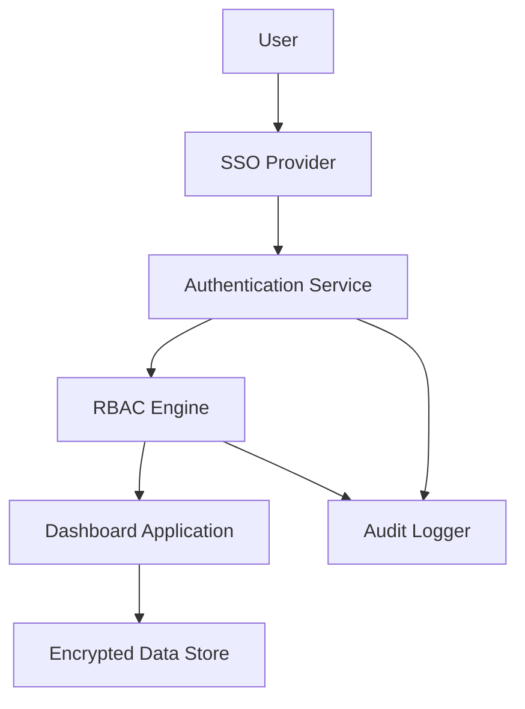

#### 1. High-Level Design

- **Summary**: This epic establishes comprehensive role-based access control (RBAC) and security infrastructure for the AI Portfolio Management Dashboard. It enables Enterprise Admins to configure user permissions, assign access by company and role, manage integrations, enforce security policies, and maintain audit logs. The system integrates with existing SSO solutions for authentication and provides user lockout recovery mechanisms to protect sensitive portfolio company data.

- **Component Flow**:

- **Integration Points**: 
  - **Upstream**: Existing enterprise SSO provider for user authentication
  - **Upstream**: Enterprise identity management systems
  - **Downstream**: Dashboard application (data aggregation layer from integration epic)
  - **Lateral**: Audit logging system for compliance and security monitoring

- **Key Assumptions**: 
  - The existing SSO provider supports standard protocols (SAML 2.0 or OAuth 2.0/OIDC) for seamless integration
  - User roles and permission models can be mapped to four primary personas (Enterprise Admin, Operating Partner, Deal Partner, General Partner)

- **NFR Highlights**: All data in transit and at rest must be encrypted using TLS 1.2+ and AES-256; System must support 1,000 concurrent users; User lockout recovery email must be sent within 2 minutes

- **Data Flow**: Users authenticate via SSO Provider, which validates credentials and returns authentication tokens to the Authentication Service. The Authentication Service passes user identity to the RBAC Engine, which evaluates permissions based on assigned roles and company access. The RBAC Engine grants or denies access to Dashboard Application resources, logging all access attempts (authorized and unauthorized) to the Audit Logger. The Dashboard Application retrieves and displays only authorized data from the Encrypted Data Store based on RBAC policies.

#### 2. Validation Report

- **Requirements Coverage**: The design fully covers the epic's stated scope including RBAC implementation, SSO integration, audit logging, user permission management, security policy enforcement, data anonymization capabilities, and user lockout recovery. All specified NFRs (encryption standards, concurrent user support, recovery email timing) are addressed. The component flow demonstrates clear separation of concerns between authentication, authorization, application logic, and audit logging, which aligns with enterprise security best practices for protecting sensitive portfolio data across 50-200 portfolio companies.