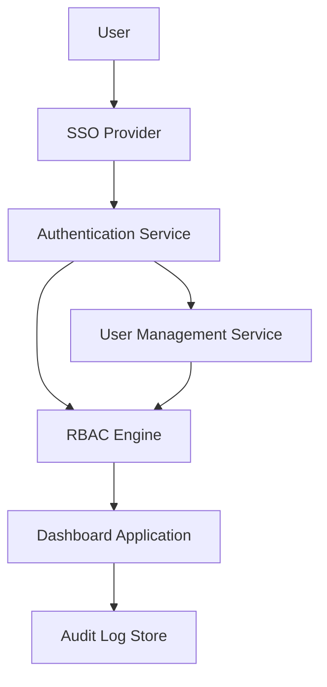

#### 1. High-Level Design

- **Summary**: This epic establishes comprehensive role-based access control (RBAC) and security infrastructure for the AI Portfolio Management Dashboard. It enables Enterprise Admins to configure user permissions, assign access by company and role, manage integrations, enforce security policies, and maintain audit logs. The system integrates with existing SSO solutions for authentication and provides user lockout recovery mechanisms to protect sensitive portfolio company data.

- **Component Flow**:

- **Integration Points**: 
  - Upstream: Existing enterprise SSO provider for user authentication
  - Upstream: Enterprise identity management systems
  - Downstream: Dashboard application (from Analytics epic QE-4732)
  - Downstream: Data aggregation layer (from Integration epic QE-4730)

- **Key Assumptions**: 
  - SSO provider supports standard protocols (SAML 2.0 or OAuth 2.0/OIDC) for integration
  - User roles map to four primary personas: Enterprise Admin, Operating Partner, Deal Partner, General Partner

- **NFR Highlights**: All data encrypted with TLS 1.2+ in transit and AES-256 at rest; must support 1,000 concurrent users; user lockout recovery email within 2 minutes; mandatory audit logging for all access attempts

- **Data Flow**: User initiates login → SSO provider authenticates credentials → Authentication Service validates token and retrieves user identity → RBAC Engine checks user permissions and assigned companies → Dashboard Application grants access to authorized data only → All access attempts logged to Audit Log Store. Enterprise Admins interact with User Management Service to assign/revoke permissions, which updates the RBAC Engine rules.

#### 2. Validation Report

- **Requirements Coverage**: The design fully covers the epic's stated scope including RBAC implementation, SSO integration, audit logging, user lockout recovery, security policy enforcement, and data anonymization capabilities. All mandatory NFRs (encryption standards, concurrent user support, audit logging, recovery time) are addressed in the architecture. The component flow demonstrates clear separation of concerns between authentication, authorization, and audit functions, supporting the enterprise-grade security requirements specified in the epic.