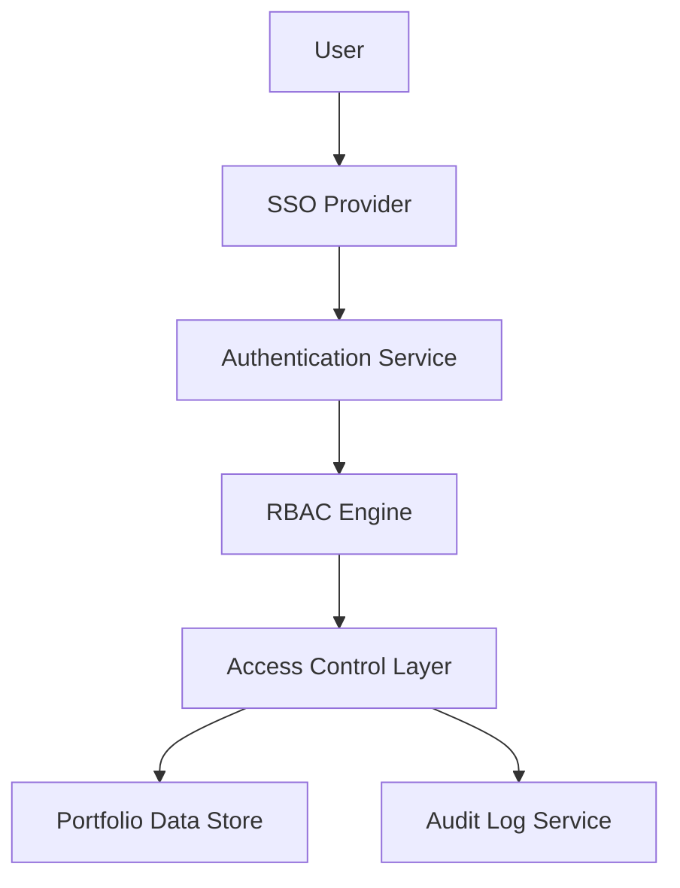

#### 1. High-Level Design

**Summary:** This epic establishes a comprehensive security framework with role-based access control (RBAC) to protect sensitive portfolio company data. Enterprise Admins can configure user permissions, manage integrations, assign users to specific companies, and monitor access logs. The system enforces strict data segregation, integrates with existing SSO solutions for authentication, and provides audit trails for compliance.

**Component Flow:**

**Integration Points:**
- **Upstream:** Existing SSO provider for user authentication
- **Downstream:** Portfolio Data Store (from Epic QE-4733 - Data Integration and Aggregation)
- **Lateral:** Cloud provider APIs for secure data access
- **External:** Portfolio companies' authorization systems for data access permissions

**Key Assumptions:**
- SSO provider supports standard protocols (SAML 2.0 or OAuth 2.0) and can handle 1,000 concurrent users without custom development.
- Portfolio company data is already tagged/organized by company identifier in the data store to enable company-level segregation.

**NFR Highlights:** All data encrypted using TLS 1.2+ and AES-256; must support 1,000 concurrent users; user lockout recovery email within 2 minutes; mandatory audit logging for all access attempts.

**Data Flow:** User initiates login → SSO Provider authenticates credentials → Authentication Service validates session and retrieves user role/company assignments → RBAC Engine evaluates permissions based on role and company mapping → Access Control Layer filters data queries to only include assigned companies → Portfolio Data Store returns authorized data → All access attempts logged to Audit Log Service for compliance tracking.

#### 2. Validation Report

**Requirements Coverage:** The high-level design fully covers the epic's stated scope including role-based access control implementation, user permission management by company and role, SSO integration, access audit logging, user lockout/recovery mechanisms, data encryption, and company-level data segregation. The architecture addresses all specified NFRs (encryption standards, concurrent user support, recovery email timing, audit logging requirements) and accounts for all stated dependencies (SSO provider, cloud provider APIs, portfolio company authorizations). The design provides clear separation of concerns with dedicated components for authentication, authorization, access control, and audit logging, ensuring security, scalability, and compliance requirements are met.