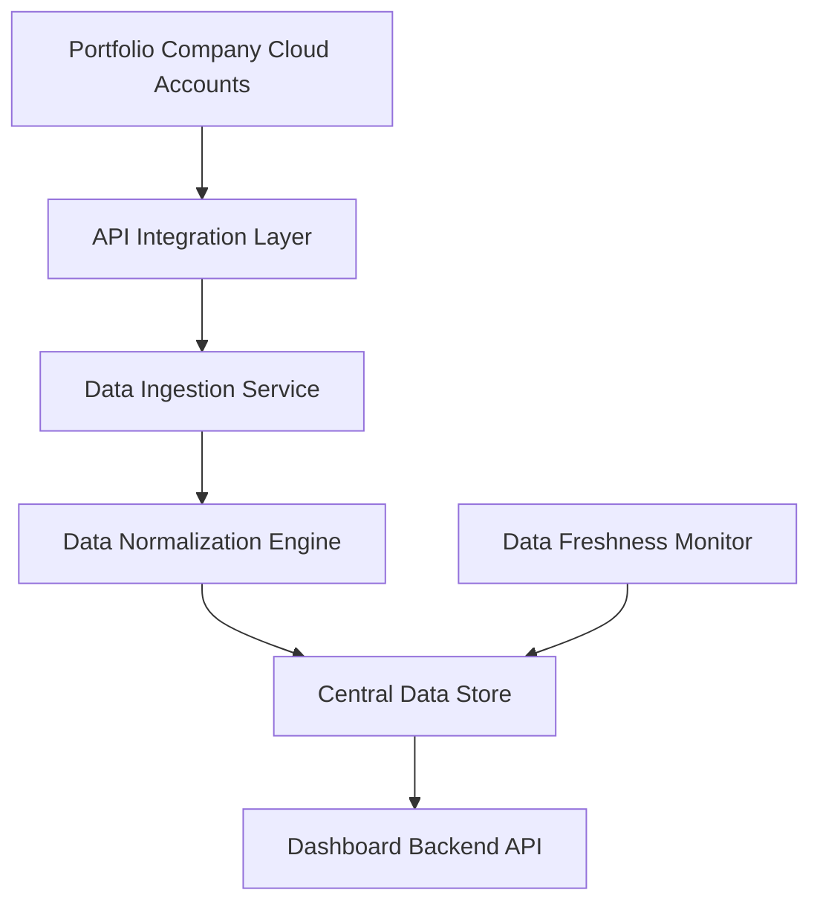

#### 1. High-Level Design

- **Summary**: This epic establishes the foundational data layer for the AI Portfolio Management Dashboard by implementing secure API integrations with AWS, Azure, and GCP to automatically collect, normalize, and aggregate AI usage and spend data from all portfolio companies. The system provides real-time visibility into AI technology adoption across the portfolio, monitors data freshness, and alerts users when data is missing or outdated.

- **Component Flow**:

- **Integration Points**: 
  - **Upstream**: AWS AI Services APIs, Azure AI Services APIs, GCP AI Services APIs, Portfolio company cloud provider accounts
  - **Downstream**: Dashboard Visualization and Analytics epic (QE-4743), Security and Access Control epic (QE-4744), SSO provider for authentication

- **Key Assumptions**: 
  - Portfolio companies have already granted API access permissions to their cloud provider accounts
  - Data schemas from AWS, Azure, and GCP can be normalized into a unified format without significant data loss

- **NFR Highlights**: Dashboard pages must load within 3 seconds for 95% of user interactions with data from up to 50 portfolio companies; 95% data freshness compliance within 24 hours; 99.5% uptime with automated failover; encryption using TLS 1.2+ and AES-256; support for up to 200 portfolio companies and 1,000 concurrent users

- **Data Flow**: The system continuously polls cloud provider APIs (AWS, Azure, GCP) for AI usage and spend data from portfolio companies. Raw data is ingested by the Data Ingestion Service, normalized by the Data Normalization Engine to create a unified schema, and stored in the Central Data Store with encryption at rest. The Data Freshness Monitor tracks update timestamps and triggers alerts when data exceeds 24-hour staleness thresholds. The Dashboard Backend API queries the Central Data Store to serve aggregated, real-time data to the visualization layer, with all data encrypted in transit via TLS 1.2+.

#### 2. Validation Report

- **Requirements Coverage**: The design fully covers the epic's stated scope including integration with all three major cloud providers (AWS, Azure, GCP), automated data ingestion and synchronization, data normalization and storage, real-time aggregation across portfolio companies, data freshness monitoring with alerts for missing or outdated data, and compliance with all specified NFRs (3-second load times, 95% data freshness within 24 hours, 99.5% uptime, encryption standards, scalability to 200 companies and 1,000 concurrent users). The architecture supports the foundational requirements needed by downstream epics for visualization, analytics, and security features.