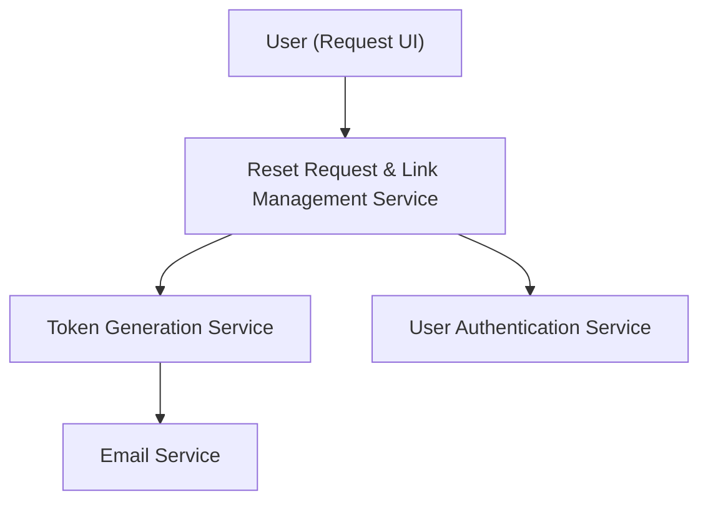

#### 1. High-Level Design
- Summary: Allow users to securely request a unique, time-bound password reset link that expires after 15 minutes and can only be used once.
- Component Flow:

- Integration Points: Email service; user authentication system; token generation service.
- Key Assumptions:
  - Link management includes tracking status (active/expired/used) to enforce single use and expiration.
  - Security policies for reset endpoints follow enterprise standards defined elsewhere.
- NFR Highlights: 15-minute expiry; cryptographically secure and non-guessable links; brute-force protection; enterprise security policy compliance.

#### 2. Validation Report
- Requirements Coverage: The design provides the necessary flow for requesting, generating, expiring, and validating reset links, meeting the epic’s constraints.
