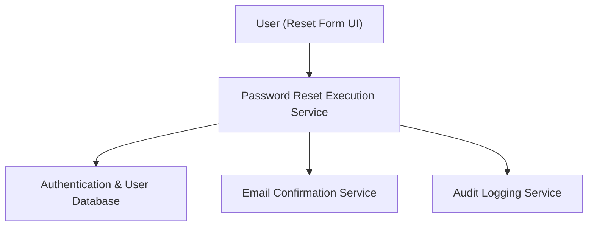

#### 1. High-Level Design
- Summary: Handle the actual password reset after a user clicks a valid link, including password update, email confirmation, and logging/audit.
- Component Flow:

- Integration Points: Email notification; user database; authentication service; audit logging platform.
- Key Assumptions:
  - Reset execution invalidates active sessions associated with old credentials.
  - Audit logs are centrally stored and accessible to security teams.
- NFR Highlights: Enterprise password complexity; atomic transaction; comprehensive logging; passwords encrypted with industry-standard hashing.

#### 2. Validation Report
- Requirements Coverage: The design supports secure reset, confirmation, logging, and encryption, adequately covering the epic’s requirements.
