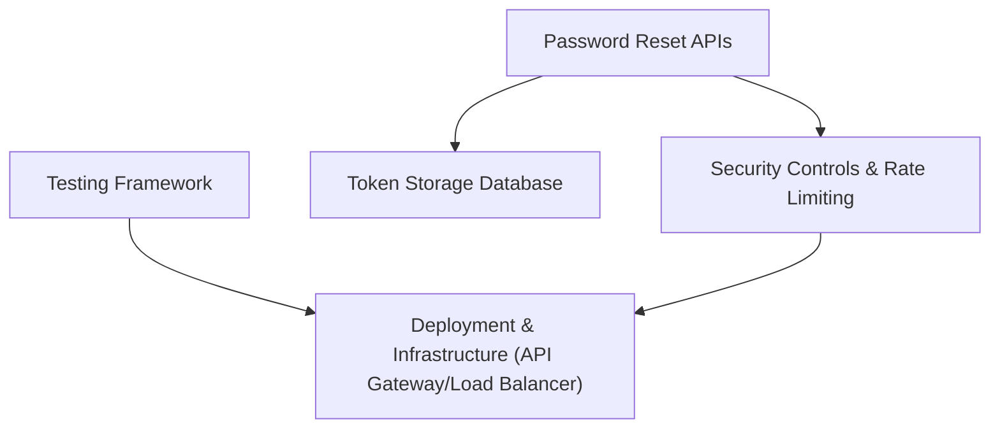

#### 1. High-Level Design
- Summary: Provide the security controls, APIs, database changes, tests, and deployment strategies to support the password reset feature at enterprise scale.
- Component Flow:

- Integration Points: API gateway; database management system; security monitoring tools; CI/CD pipeline; load balancer.
- Key Assumptions:
  - APIs for reset request and execution are exposed via a shared gateway and follow common security policies.
  - Database schema changes are rolled out using backward-compatible migrations through CI/CD.
- NFR Highlights: Enterprise-scale traffic support; backward-compatible DB changes; HTTPS for all API calls; rate limiting; zero-downtime deployment.

#### 2. Validation Report
- Requirements Coverage: The design incorporates required APIs, DB changes, security, tests, and deployment practices, aligning with the epic’s functional and non-functional scope.
