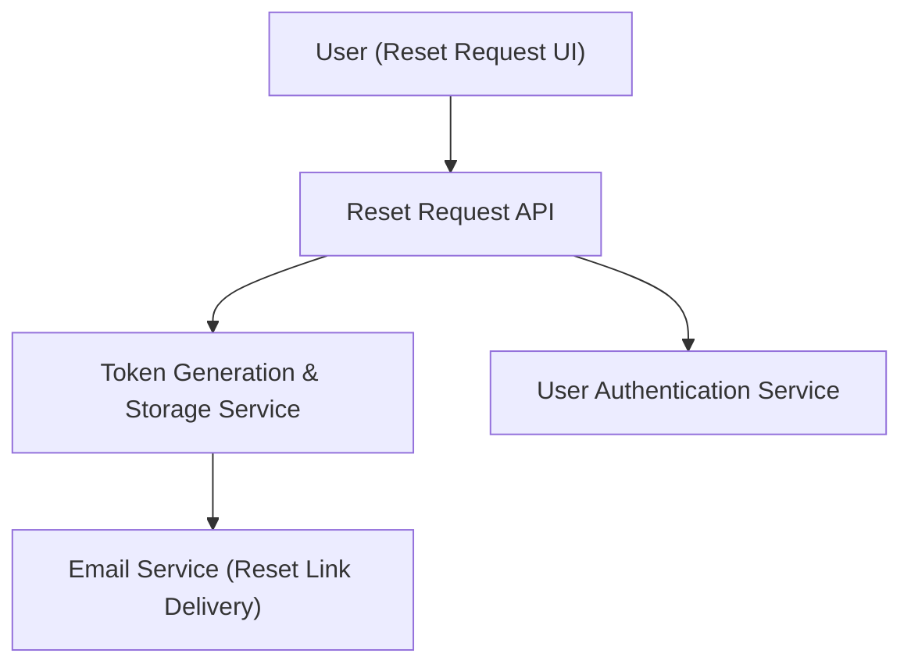

#### 1. High-Level Design
- Summary: Enable users to initiate password reset by requesting a secure, time-limited, single-use reset link via email.
- Component Flow:

- Integration Points: Email service; authentication service to validate registered emails; database for token storage.
- Key Assumptions:
  - Token metadata includes creation time and usage flag for enforcing 15-minute expiry and single use.
  - Reset links embed tokens in secure URLs accessible over HTTPS only.
- NFR Highlights: Cryptographically secure token generation; strict 15-minute expiration; single-use token invalidation; brute-force protection on endpoints.

#### 2. Validation Report
- Requirements Coverage: The design covers all main aspects: request handling, secure token generation/storage, expiry, single-use enforcement, and email delivery, aligned with the epic.
