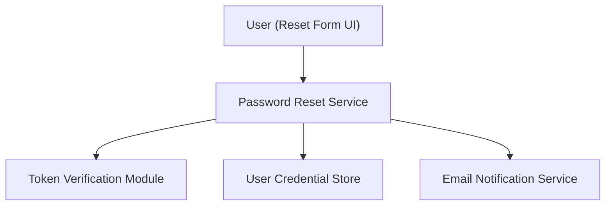

#### 1. High-Level Design
- Summary: Cover the password reset workflow after a user clicks the reset link, including secure new password setting and post-reset confirmation email.
- Component Flow:

- Integration Points: Email service; user authentication service; credential database; encryption service for hashing.
- Key Assumptions:
  - Token verification and invalidation occur in a single atomic transaction with password update.
  - Confirmation emails use existing notification infrastructure and templates.
- NFR Highlights: Password complexity per enterprise standards; atomic password update; confirmation email within 30 seconds; password data encrypted in transit and at rest.

#### 2. Validation Report
- Requirements Coverage: The architecture supports token validation, secure password update, encryption, and timely confirmation emails, addressing the epic’s stated requirements.
