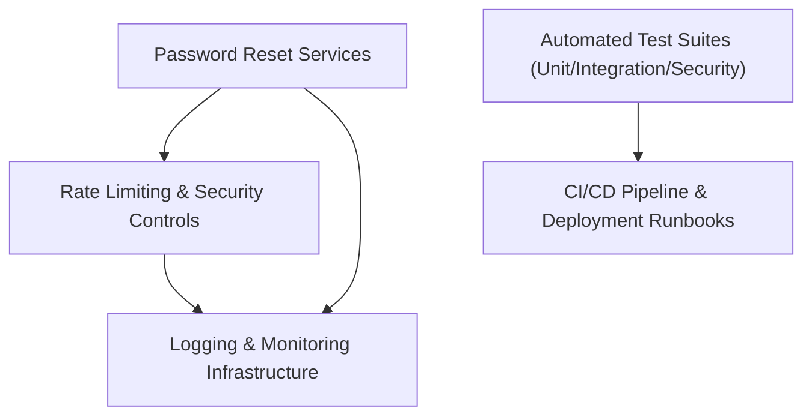

#### 1. High-Level Design
- Summary: Implement security controls and comprehensive test/deployment infrastructure to safely deliver the password reset feature, including rate limiting, logging, validation, security tests, and operational runbooks.
- Component Flow:

- Integration Points: Logging/monitoring platforms; rate-limiting service; security scanning tools; CI/CD pipeline; database migration tools.
- Key Assumptions:
  - All reset-related entry points route through a shared security control layer for rate limiting and validation.
  - Test suites are integrated into the CI/CD pipeline for gatekeeping deployments.
- NFR Highlights: Max 3 reset attempts per email per hour; full logging of reset attempts; protections against CSRF/XSS/token enumeration; ≥80% test coverage for reset-related code.

#### 2. Validation Report
- Requirements Coverage: The design clearly supports the specified security controls, testing, monitoring, and deployment needs, aligning with the epic’s scope and NFRs.
