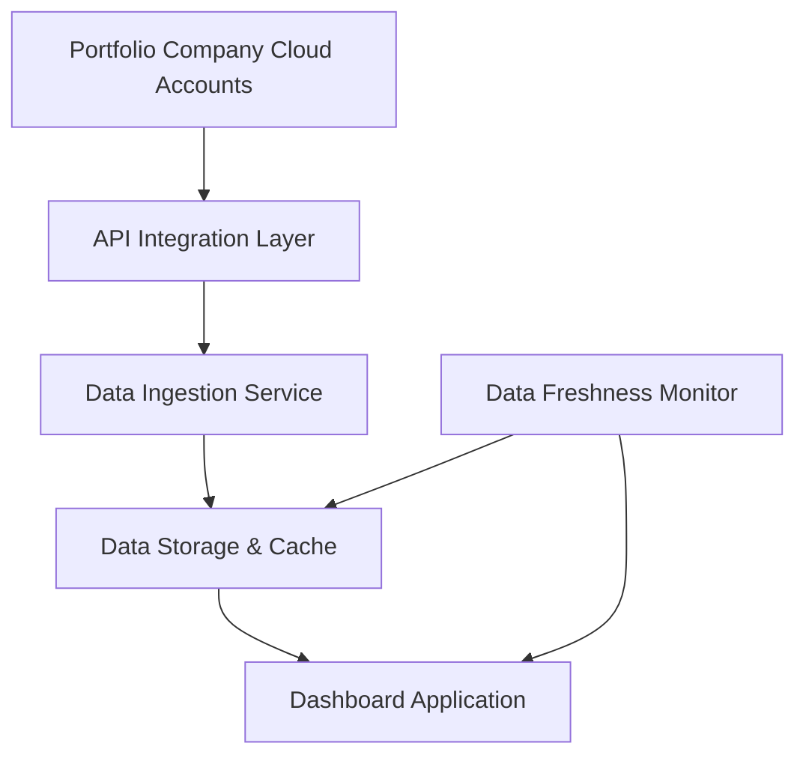

#### 1. High-Level Design

- **Summary**: This epic establishes the foundational data pipeline for automated collection and aggregation of AI usage and spend data from AWS, Azure, and GCP across all portfolio companies. It provides secure API integrations, real-time data synchronization, data freshness monitoring, and alerting capabilities to ensure data completeness and accuracy for downstream analytics and reporting.

- **Component Flow**:

- **Integration Points**: 
  - **Upstream Systems**: AWS AI Services APIs, Azure AI Services APIs, GCP AI Services APIs, Portfolio company cloud accounts and credentials
  - **Downstream Systems**: Portfolio Dashboard and Analytics (Epic QE-4757), notification services for data freshness alerts, authentication/authorization services

- **Key Assumptions**: 
  - Portfolio companies will provide API credentials and enable necessary permissions within 2 weeks of onboarding request
  - Cloud provider APIs return standardized usage and billing data in JSON format with consistent schema

- **NFR Highlights**: Dashboard pages must load within 3 seconds for 95% of user interactions; 99.5% uptime with automated failover; all data encrypted using TLS 1.2+ in transit and AES-256 at rest; support up to 200 portfolio companies and 1,000 concurrent users; 95% of portfolio data updated within 24 hours

- **Data Flow**: Portfolio company cloud accounts expose AI usage and spend data via provider APIs (AWS, Azure, GCP). The API Integration Layer authenticates and queries these endpoints on a scheduled basis. The Data Ingestion Service processes, normalizes, and validates incoming data, then stores it in the Data Storage & Cache layer. The Data Freshness Monitor continuously checks data timestamps and triggers alerts when data exceeds 24-hour staleness threshold. The Dashboard Application queries the data storage layer to render real-time visualizations and analytics for end users.

#### 2. Validation Report

- **Requirements Coverage**: The design fully covers the epic's stated scope including integration with three major cloud providers (AWS, Azure, GCP), automated data ingestion and synchronization, data freshness indicators and notifications, missing/outdated data alerts, and support for up to 50 portfolio companies in initial release (scalable to 200). All specified NFRs are addressed including 3-second load times, 99.5% uptime, encryption standards (TLS 1.2+, AES-256), concurrent user support (1,000), and data freshness requirements (95% within 24 hours). The design accounts for all stated dependencies (cloud provider APIs, portfolio company API access) and respects out-of-scope boundaries (no on-premise integrations, no niche platforms in initial release).