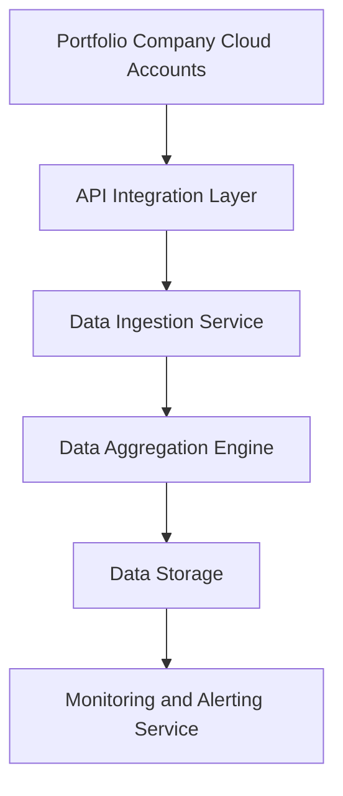

#### 1. High-Level Design

- **Summary**: This epic establishes an automated data pipeline to collect and aggregate AI usage and spend data from AWS, Azure, and GCP across up to 50 portfolio companies. The solution provides secure API integrations, real-time data synchronization, data freshness monitoring, and alerting capabilities to eliminate manual data collection and ensure up-to-date visibility into AI technology adoption.

- **Component Flow**:

- **Integration Points**: 
  - **Upstream**: AWS, Azure, and GCP cloud provider APIs for AI service usage and billing data
  - **Downstream**: Dashboard and analytics components (from Portfolio Dashboard epic) that consume the aggregated data
  - **External**: Portfolio company cloud accounts requiring API access credentials and permissions

- **Key Assumptions**: 
  - Portfolio companies will provide API credentials with read-only access to AI service usage and billing data within a standard onboarding timeframe
  - Cloud provider APIs will maintain backward compatibility and provide sufficient rate limits for polling up to 50 companies every 24 hours

- **NFR Highlights**: Dashboard load time ≤3 seconds for 95% of interactions; support 200 companies and 1,000 concurrent users; TLS 1.2+ and AES-256 encryption; 99.5% uptime with automated failover; 95% of data updated within 24 hours

- **Data Flow**: 
  1. **Input**: The API Integration Layer authenticates with portfolio company cloud accounts (AWS/Azure/GCP) using secure credentials and retrieves AI service usage metrics and spend data via REST APIs
  2. **Processing**: The Data Ingestion Service validates, normalizes, and transforms raw cloud provider data into a unified schema; the Data Aggregation Engine consolidates data across multiple companies and time periods, calculating totals and trends
  3. **Output**: Aggregated data is stored in encrypted Data Storage with timestamps; the Monitoring Service tracks data freshness and triggers alerts when data is missing or outdated (>24 hours); downstream dashboard components query this storage for visualization

#### 2. Validation Report

- **Requirements Coverage**: The design fully covers the epic's stated scope including secure API integrations with all three major cloud providers, automated data ingestion and synchronization, data freshness indicators and alerts, and support for 50 portfolio companies. All specified NFRs (performance, encryption, uptime, data freshness) are addressed through dedicated components. The architecture supports the stated dependencies on cloud provider APIs and portfolio company credentials while respecting the out-of-scope constraints (no on-premise platforms, no niche AI providers in initial release).