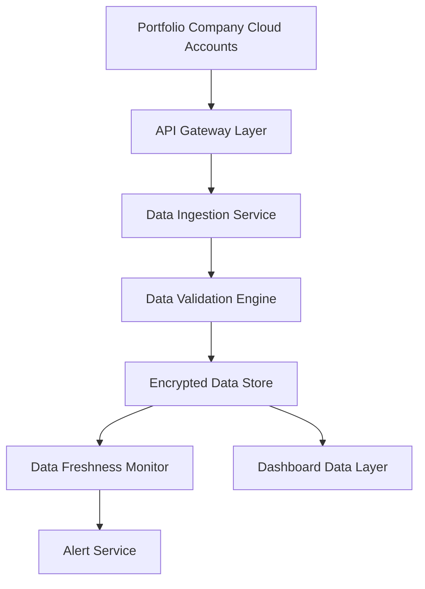

#### 1. High-Level Design

- **Summary**: This epic establishes the foundational data layer for the AI Portfolio Management Dashboard by automating the collection, aggregation, and synchronization of AI usage and spend data from three major cloud providers (AWS, Azure, GCP) across all portfolio companies. It ensures real-time data availability, monitors data freshness, and provides automated alerts when data becomes outdated or missing.

- **Component Flow**:

- **Integration Points**: 
  - **Upstream**: AWS AI Services APIs, Azure AI Services APIs, GCP AI Services APIs (requires portfolio companies to grant API access and permissions)
  - **Downstream**: Dashboard visualization layer (Epic QE-4764), Security and reporting layer (Epic QE-4765)

- **Key Assumptions**: 
  - Portfolio companies will provide necessary API credentials and permissions within standard OAuth/service account frameworks.
  - AI usage data from cloud providers follows consistent schema patterns (cost, service type, usage metrics) that can be normalized into a unified data model.

- **NFR Highlights**: Dashboard pages must load within 3 seconds for 95% of interactions with up to 50 portfolio companies; system must support up to 200 portfolio companies and 1,000 concurrent users; all data encrypted with TLS 1.2+ and AES-256; 99.5% uptime with automated failover; 95% of portfolio data updated within 24 hours.

- **Data Flow**: Portfolio company cloud accounts expose AI usage and spend data via secure APIs → API Gateway Layer authenticates and routes requests → Data Ingestion Service polls APIs at scheduled intervals and retrieves raw data → Data Validation Engine normalizes, validates, and cleanses data from different cloud providers → Encrypted Data Store persists validated data with encryption at rest → Data Freshness Monitor continuously checks data timestamps and triggers alerts via Alert Service when data exceeds 24-hour threshold → Dashboard Data Layer queries the encrypted store to serve real-time analytics to end users.

#### 2. Validation Report

- **Requirements Coverage**: The design fully covers the epic's stated scope including API integration with AWS/Azure/GCP, automated data ingestion pipelines, real-time synchronization, data freshness indicators, missing data alerts, data validation, and secure storage. All specified NFRs (performance, scalability, security, reliability, data freshness) are addressed through dedicated components (API Gateway for security, Data Freshness Monitor for timeliness, encrypted storage for security, distributed architecture for scalability). The design explicitly handles the stated dependencies (cloud provider APIs and portfolio company permissions) and respects the out-of-scope constraints (no on-premise integrations, no niche platforms in initial release).