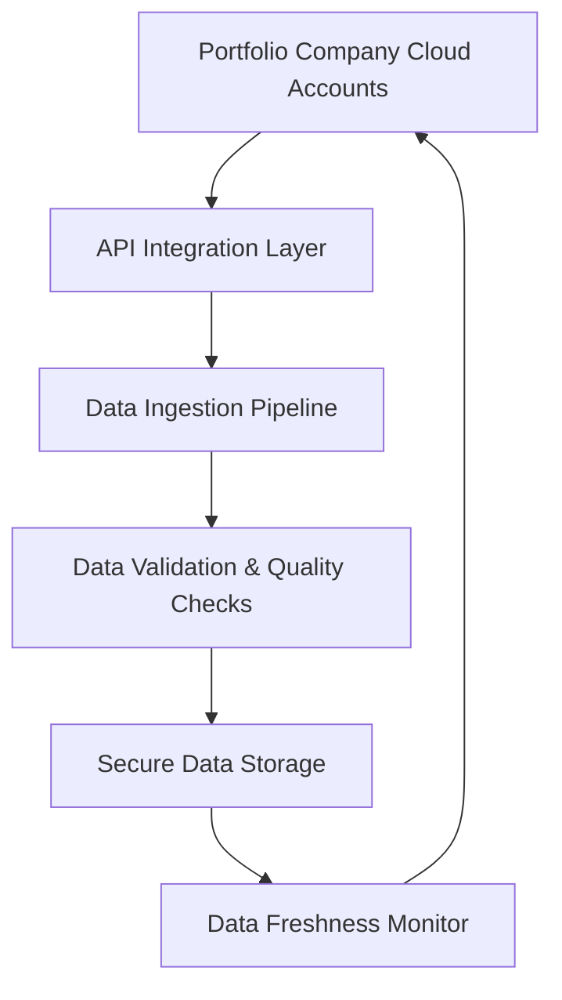

#### 1. High-Level Design

- **Summary:** This epic establishes the foundational data layer for the AI Portfolio Management Dashboard by automating the collection, aggregation, and synchronization of AI usage and spend data from AWS, Azure, and GCP across all portfolio companies. It ensures real-time data availability, monitors data freshness, and alerts users when data becomes outdated or missing.

- **Component Flow:**

- **Integration Points:**
  - **Upstream Systems:** AWS AI Services APIs, Azure AI Services APIs, GCP AI Services APIs
  - **Downstream Systems:** Dashboard visualization layer (Epic 2), reporting and analytics modules (Epic 3)
  - **External Dependencies:** Portfolio companies' cloud provider API access and permissions

- **Key Assumptions:** 
  - Portfolio companies will grant necessary API permissions and maintain active cloud provider accounts with consistent credential management.
  - Data schemas from AWS, Azure, and GCP APIs are sufficiently standardized to enable unified aggregation without extensive transformation logic.

- **NFR Highlights:** Dashboard pages must load within 3 seconds for 95% of interactions with up to 50 portfolio companies; all data encrypted using TLS 1.2+ and AES-256; 99.5% uptime; 95% of portfolio data updated within last 24 hours.

- **Data Flow:** Portfolio company cloud accounts expose AI usage and spend data via secure APIs. The API Integration Layer authenticates and retrieves data from AWS, Azure, and GCP. The Data Ingestion Pipeline processes and normalizes incoming data streams in real-time. Data Validation & Quality Checks ensure accuracy, completeness, and consistency before storage. Validated data is stored in Secure Data Storage (encrypted at rest). The Data Freshness Monitor continuously checks data timestamps, triggers alerts when data exceeds 24-hour staleness threshold, and notifies users of missing or outdated data.

#### 2. Validation Report

- **Requirements Coverage:** The design fully covers the epic's stated scope including API integration with three major cloud providers, automated data ingestion pipelines, real-time synchronization, data freshness indicators, missing data alerts, data validation, and secure storage. All specified NFRs (performance, encryption, uptime, data freshness) are addressed in the architecture. Dependencies on cloud provider APIs and portfolio company permissions are acknowledged. Out-of-scope items (on-premise platforms, niche AI providers) are correctly excluded from this design.