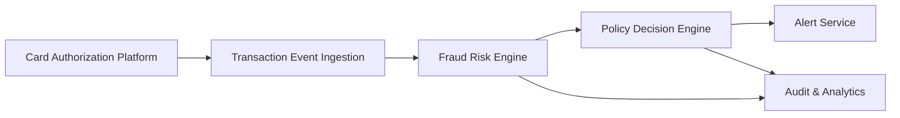

#### 1. High-Level Design

- **Summary**: This epic implements a real-time fraud detection system that ingests credit card transaction events, evaluates fraud risk using a scoring engine with multiple signals (amount anomalies, geographic inconsistencies, merchant behavior, transaction velocity, device risk), and triggers alerts based on configurable risk thresholds. The system categorizes transactions into risk levels (low, medium, high, confirmed fraud) and routes them to appropriate treatment paths while maintaining comprehensive audit trails.

- **Component Flow**:

- **Integration Points**: 
  - **Upstream**: Card authorization/transaction platform (transaction event source)
  - **Downstream**: Fraud-risk engine/model for risk scoring, Policy/decision engine for risk-to-action mapping, Alert service for alert creation, Analytics and audit infrastructure for decision logging

- **Key Assumptions**: 
  - Transaction events are delivered in a standardized JSON/Avro format via event streaming platform (e.g., Kafka)
  - Risk scoring engine returns scores within 100-200ms to meet near-real-time SLA requirements

- **NFR Highlights**: Near-real-time processing SLA for risk evaluation and alert triggering; high availability for security-critical services with disaster recovery; support for transaction volume spikes; comprehensive metrics, logs, and traces for latency and error monitoring; model performance and drift monitoring.

- **Data Flow**: Transaction events flow from the card authorization platform to the ingestion layer, which applies idempotency checks to prevent duplicate processing. Each transaction is enriched with contextual signals (amount, geography, merchant, velocity, device) and sent to the fraud risk engine for scoring. The risk score is evaluated by the policy decision engine against configurable thresholds to determine the risk level (low/medium/high/confirmed fraud). Based on the risk level, the policy engine triggers appropriate actions including alert creation via the alert service. All risk decisions and scores are logged to the audit and analytics infrastructure for compliance, monitoring, and model performance tracking.

#### 2. Validation Report

- **Requirements Coverage**: The design covers all core requirements specified in the epic including transaction event ingestion, risk score calculation, configurable threshold evaluation, risk decision model implementation with multiple risk levels, risk signal processing across five key dimensions, policy engine integration, idempotency handling, fail-safe policies, and audit trail creation. The architecture supports the stated NFRs for near-real-time processing, high availability, scalability during transaction spikes, and comprehensive observability. All identified dependencies (authorization platform, risk engine, policy engine, analytics infrastructure) are incorporated into the component flow.