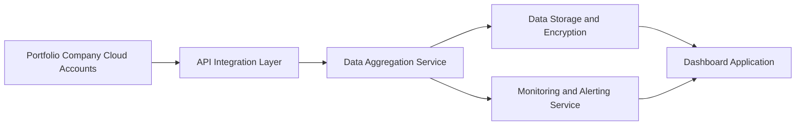

#### 1. High-Level Design

- **Summary**: This epic establishes automated data integration capabilities to connect the AI Portfolio Management Dashboard with major cloud providers (AWS, Azure, GCP) to aggregate AI usage and spend data from portfolio companies. The system provides real-time data synchronization, data freshness monitoring, and automated notifications when data becomes outdated, serving as a single source of truth for AI technology adoption across the entire portfolio.

- **Component Flow**:

- **Integration Points**: 
  - **Upstream**: AWS, Azure, and GCP cloud provider APIs for AI service usage and billing data
  - **Downstream**: AI Portfolio Management Dashboard for data visualization and analytics
  - **Supporting**: Email notification service for automated alerts when data becomes outdated (>24 hours)

- **Key Assumptions**: 
  - Portfolio companies will grant necessary API access permissions to their cloud provider accounts for data extraction
  - Data format from cloud providers will be standardized or mappable to a common schema for aggregation

- **NFR Highlights**: Dashboard pages must load within 3 seconds for 95% of user interactions with data from up to 50 portfolio companies; System must support up to 200 portfolio companies and 1,000 concurrent users; All data encrypted using TLS 1.2+ (transit) and AES-256 (rest); 99.5% uptime with automated failover; Data updated within 24 hours for 95% of companies.

- **Data Flow**: Portfolio company cloud accounts expose AI usage and spend data via cloud provider APIs (AWS, Azure, GCP). The API Integration Layer authenticates and retrieves data from these sources using secure credentials. The Data Aggregation Service normalizes, transforms, and consolidates data from multiple cloud providers into a unified format. Aggregated data is encrypted and stored in the Data Storage layer. The Dashboard Application queries this storage to present real-time visualizations. The Monitoring and Alerting Service continuously tracks data freshness and triggers automated notifications when data exceeds 24-hour staleness threshold.

#### 2. Validation Report

- **Requirements Coverage**: The design comprehensively covers the epic's stated scope including integration with AWS/Azure/GCP AI services via secure APIs, automated data synchronization and aggregation, data freshness indicators and monitoring, automated alerts for missing or outdated data (>24 hours), and secure data transmission and storage with encryption. All NFRs are addressed including the 3-second page load requirement, support for up to 200 portfolio companies and 1,000 concurrent users, encryption standards (TLS 1.2+ and AES-256), 99.5% uptime with automated failover, and 24-hour data update SLA for 95% of companies. The component flow explicitly shows the integration points with cloud provider APIs and the monitoring/alerting mechanism for data freshness.