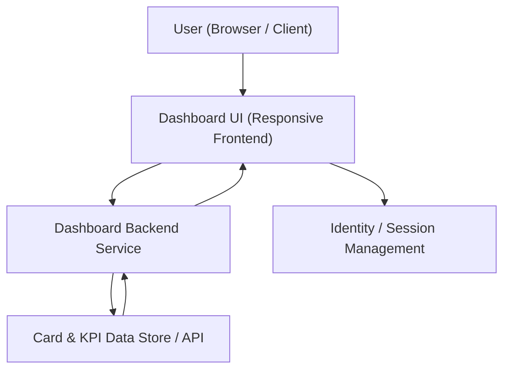

#### 1. High-Level Design
- Summary: Deliver a modern, responsive dashboard that consolidates all credit cards into a single interface and presents key KPIs (monthly spend, total credit limit, available credit, outstanding amount) to give users a clear snapshot of their overall credit usage.

- Component Flow:

- Integration Points:
  - Internal card data store or API providing card details, limits, balances, and transaction-derived KPIs.
  - Identity/session management to associate cards and KPIs with the authenticated user profile.
  - UI framework or component library used to implement responsive dashboard layouts.

- Key Assumptions:
  - Card and KPI data (limits, balances, monthly spend) are already pre-calculated or can be derived from existing internal data sources without requiring real bank integrations.
  - User authentication and session handling are provided by an existing identity layer, and the dashboard backend receives an already-authenticated user context.

- NFR Highlights:
  - Dashboard should load within acceptable time for typical consumer internet connections, with responsive UI across desktop, tablet, and mobile, and KPIs updating promptly when underlying data changes.

- Data Flow:
  - The authenticated user accesses the responsive dashboard UI, which initiates calls to the dashboard backend service using the user’s session context. The backend queries the internal card and KPI data store/API to fetch per-card limits, balances, and computed KPIs (monthly spend, total credit limit, available credit, outstanding amount). The backend aggregates these values across all cards and returns a structured payload to the UI. The UI renders consolidated KPIs and card-level views, and updates them when the user refreshes or triggers interactions that require recalculating or re-fetching KPIs.  

#### 2. Validation Report
- Requirements Coverage: The described design covers the epic’s scope by providing a single consolidated dashboard that pulls card data from internal sources, calculates and exposes the specified KPIs (monthly spend, total credit limit, available credit, outstanding amounts), supports multiple cards, and ensures a responsive, performant UI aligned with the epic’s NFRs.