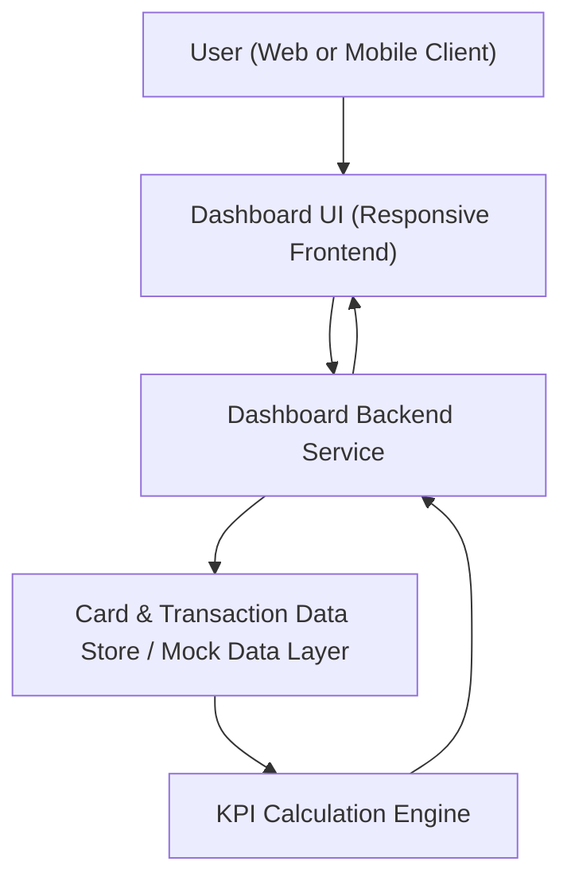

#### 1. High-Level Design

- Summary: This epic delivers a modern, responsive dashboard that consolidates key credit card KPIs (monthly spend, total credit limit, available credit, outstanding amount) across one or multiple cards into a single view, enabling users to quickly understand overall credit exposure, utilization, and liabilities.

- Component Flow:

- Integration Points:
  - Internal data source or mock data layer providing card details, limits, and transactions.
  - Presentation layer / dashboard framework responsible for responsive UI rendering.

- Key Assumptions:
  - Card and transaction data is already normalized in a single internal data source or mock layer (no real bank integration).
  - KPI updates are triggered on user navigation or periodic refresh, not continuous real-time streaming.

- NFR Highlights: Dashboard views must load within modern web UX expectations, remain responsive across device sizes, and compute KPI values accurately and consistently across all supported cards.

- Data Flow:
  - Inputs: The dashboard backend retrieves card metadata (limits, available credit, outstanding balances) and transaction aggregates for the selected time window from the internal data store/mock layer.
  - Processing: The KPI Calculation Engine aggregates monthly spend, sums total credit limits for all cards, computes available credit and outstanding amounts, and aligns per-card values to consolidated KPIs.
  - Outputs: The backend returns structured KPI data to the dashboard UI, which renders consolidated KPIs and multi-card views in a responsive layout; users can switch cards or views, triggering repeat of this flow with updated filters. 

#### 2. Validation Report

- Requirements Coverage: The described design covers the epic’s stated scope by providing a responsive dashboard that surfaces monthly spend, total credit limit, available credit, and outstanding amount across multiple cards using an internal data source/mock layer, while aligning with the specified NFRs for load performance, responsiveness, and KPI calculation accuracy.