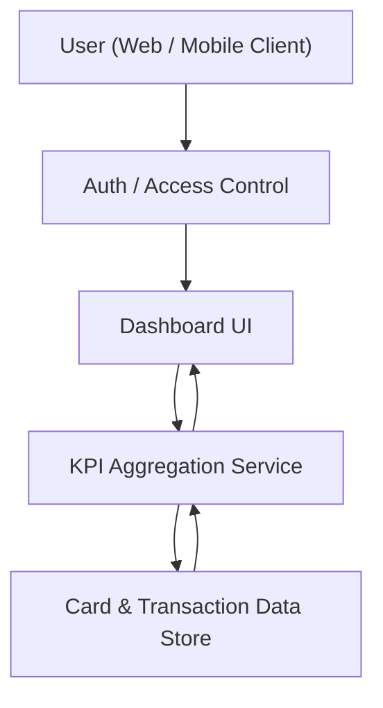

#### 1. High-Level Design
- Summary: Deliver a responsive dashboard that consolidates key credit card metrics (monthly spend, total credit limit, available credit, outstanding amount) into a single interface for one or multiple cards, enabling users to understand overall credit exposure and monthly spending.

- Component Flow:

- Integration Points:
  - Internal card and transaction data sources or mock data used to calculate monthly spend, total credit limit, available credit, and outstanding amounts.
  - No real bank integrations or payment systems are in scope; all data originates from internal or mock data stores.

- Key Assumptions:
  - Card and transaction data is pre-aggregated or readily queryable by user ID and card IDs, with clear ownership and access boundaries per user.
  - KPI calculations (e.g., monthly spend period, outstanding amount definition) follow a standardized internal business rule consistently applied across all views.

- NFR Highlights:
  - Dashboard must render KPI data within 2 seconds for a user with up to 10 credit cards, with a responsive layout across modern browsers and standard mobile resolutions, and accurate, consistent data calculations.

- Data Flow:
  - The authenticated user accesses the dashboard UI, which invokes the KPI Aggregation Service. The service queries the internal card and transaction data store for the user’s cards and transactions, computes monthly spend, total credit limit, available credit, and outstanding amounts, aggregates results across cards if needed, and returns KPI values to the dashboard UI for display in responsive KPI tiles.

#### 2. Validation Report

- Requirements Coverage:
  - The dashboard must display monthly spend, total credit limit, available credit, and outstanding amount KPIs for one or more cards linked to the user.
  - The system must support both web and mobile clients with a responsive layout.
  - KPI data must be accurate and reflect the latest available transaction and card data.

- Test Scenarios:
  - Single card user: Verify KPIs for a user with a single credit card.
  - Multi-card aggregation: Verify KPIs when the user has multiple credit cards and ensure aggregated totals are correct.
  - Performance: Measure response time for users with up to 10 credit cards and confirm KPI rendering within 2 seconds.
  - Responsiveness: Validate layout across modern desktop browsers and standard mobile resolutions.
  - Data consistency: Ensure KPI calculations follow standardized business rules documented for monthly spend and outstanding amounts.
