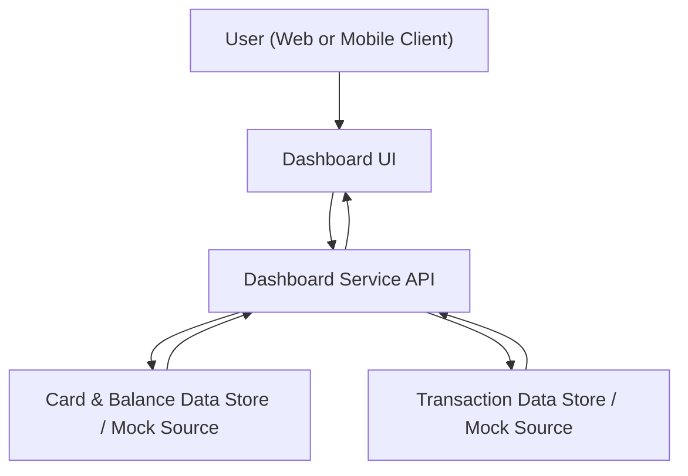

#### 1. High-Level Design
- Summary: Deliver a modern, responsive dashboard that consolidates key credit card metrics (monthly spend, total credit limit, available credit, outstanding amount) into a single interface, supporting one or multiple cards.
- Component Flow:

- Integration Points: 
  - Internal card and balance data store or mock data source (for card limits, available credit, outstanding amounts).
  - Internal transaction data store or mock data source (for monthly spend KPI).
- Key Assumptions:
  - Card and transaction data are exposed via secure internal services or mock APIs with non-sensitive identifiers (no full PANs).
  - KPIs are computed over a configurable recent period (e.g., current billing month) and refreshed on demand or at a reasonable interval.
- NFR Highlights: Dashboard must render core KPIs within 2 seconds under typical load; UI must be responsive across desktop and mobile; system must handle users with multiple cards without performance degradation.
- Data Flow: 
  - Inputs: User requests dashboard view via web/mobile client; dashboard service receives the authenticated user context.
  - Processing: Dashboard service queries card data (limits, balances, available credit) and transaction data (spend) from internal stores/mock sources, aggregates per card and across all cards, and computes KPIs (monthly spend, total credit limit, available credit, outstanding amount).
  - Outputs: Aggregated KPIs and per-card summary data returned to the Dashboard UI, which renders responsive KPI tiles and consolidated views for one or multiple cards. 

#### 2. Validation Report
- Requirements Coverage: The design covers the epic’s scope by providing a single responsive dashboard that aggregates monthly spend, total credit limit, available credit, outstanding amount, and supports multiple credit cards using internal or mock data sources, while meeting the specified performance and responsiveness NFRs.