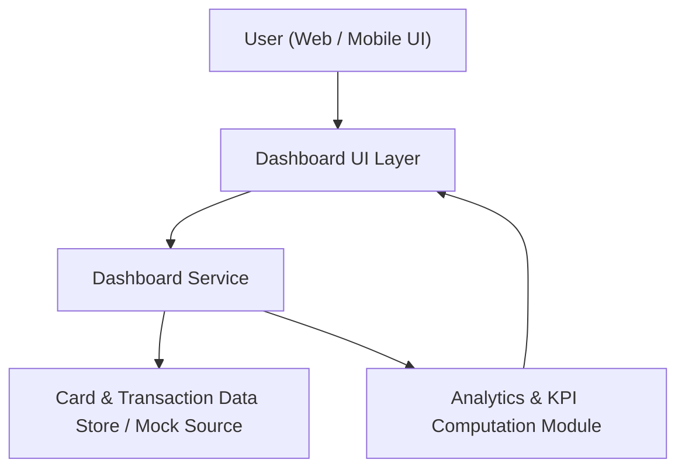

#### 1. High-Level Design
- Summary: Deliver a modern, responsive dashboard that consolidates key credit card KPIs (monthly spend, total credit limit, available credit, outstanding amount) into a single interface for one or multiple cards, providing users with a unified view of overall credit health.

- Component Flow:

- Integration Points:
  - Internal card and transaction data stores or mock data sources providing card limits, balances, and transaction aggregates.
  - Shared internal data model for credit card KPIs (monthly spend, total limit, available credit, outstanding amount).

- Key Assumptions:
  - Card and transaction data are provided via an internal API or mock service exposed within the same environment (no external bank APIs).
  - KPI values are refreshed on demand when the user loads or refreshes the dashboard (not real-time streaming).

- NFR Highlights:
  - Dashboard must render core KPIs within 2 seconds under typical load, with responsive behavior across desktop and mobile and support for multiple cards without performance degradation.

- Data Flow:
  - Inputs: User requests the dashboard via web or mobile UI; the Dashboard Service requests card and transaction data from internal data stores or mock sources.
  - Processing: The Analytics & KPI Computation Module aggregates transaction data and card attributes to compute monthly spend, total credit limit, available credit, and outstanding amount; results are formatted into a consolidated KPI payload.
  - Outputs: The Dashboard UI Layer renders KPIs and consolidated card overview to the user in a responsive layout, updating when the user refreshes or changes card selections.

#### 2. Validation Report
- Requirements Coverage: The design supports a single consolidated dashboard view for all core KPIs, uses internal or mock data sources only (no real bank integration), respects the 2-second KPI rendering requirement under typical load, and ensures responsiveness and scalability for users with multiple credit cards, thereby covering the stated epic scope.