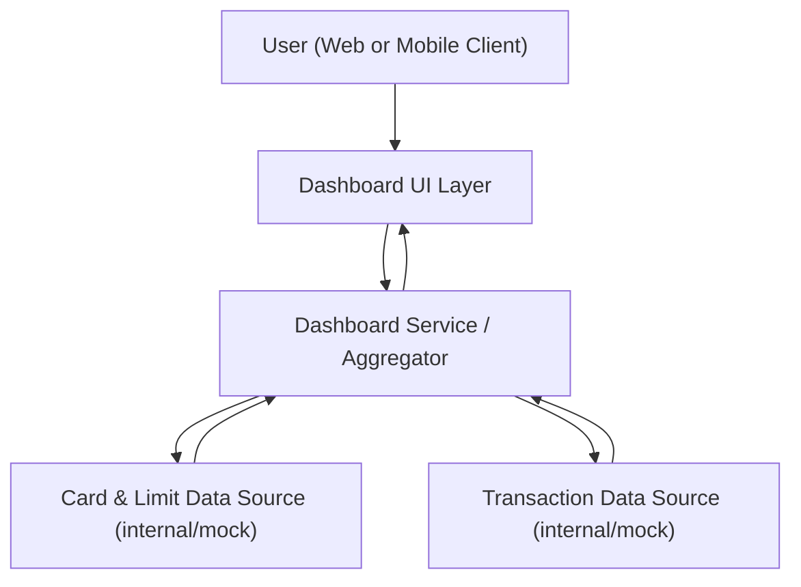

#### 1. High-Level Design

- Summary: Deliver a unified, responsive dashboard that consolidates key credit card metrics (monthly spend, total credit limit, available credit, outstanding amount) across all user cards into a single interface, with support for multiple cards and responsive layouts.

- Component Flow:

- Integration Points:
  - Internal card, transaction, and limit datasets or mock data services that provide:
    - Card metadata (card list, limits, available credit)
    - Transaction summaries to derive monthly spend and outstanding amounts
  - Core dashboard container/framework that hosts the consolidated view, navigation, and layout.

- Key Assumptions:
  - Data sources expose aggregated KPIs or can be queried efficiently (e.g., pre-aggregated monthly spend and outstanding balances per card).
  - Authentication and user-to-card mapping are handled by an existing identity/session layer, and the epic operates on already-resolved user context.

- NFR Highlights:
  - Dashboard must render core KPIs quickly with a responsive layout optimized for modern browsers and devices; performance expectations apply at typical user data volumes.

- Data Flow:
  - The user launches the dashboard UI, which requests consolidated KPI data from the Dashboard Service/Aggregator.
  - The Dashboard Service retrieves card and limit data from the Card & Limit Data Source and transaction-derived metrics (monthly spend, outstanding amounts) from the Transaction Data Source.
  - The service aggregates these into consolidated KPIs and per-card summaries, returning a structured response to the Dashboard UI.
  - The UI renders overall KPIs (total limits, total outstanding, total/monthly spend) and per-card tiles/sections, updating views responsively across devices.

#### 2. Validation Report

- Requirements Coverage: The proposed design covers the epic’s stated scope by providing a single dashboard with consolidated KPIs for all cards, multi-card support, and a responsive UI that consumes internal/mock card, transaction, and limit datasets while meeting the responsiveness and layout NFRs described in the epic.