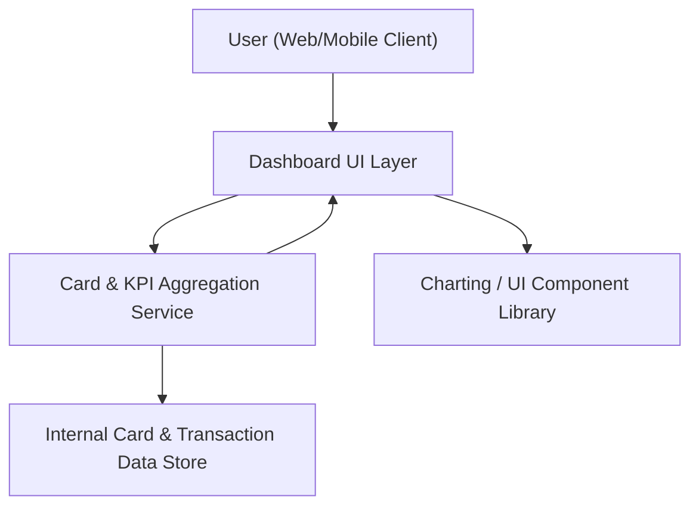

#### 1. High-Level Design
- Summary: Deliver a modern, responsive dashboard that consolidates all user credit cards and presents key financial KPIs (monthly spend, total credit limit, available credit, outstanding amount) in an intuitive, visually clear interface for monitoring overall credit exposure and financial standing.

- Component Flow:

- Integration Points:
  - Internal card data sources or mock data services providing card details, balances, limits, and transactions.
  - Front-end charting or UI component libraries rendering KPIs and summary tiles.

- Key Assumptions:
  - Card and transaction data are exposed via secure internal APIs or services with consistent schemas for limits, balances, and transactions.
  - KPI updates are triggered on user navigation/refresh or lightweight polling rather than heavy real-time streaming.

- NFR Highlights:
  - Dashboard must be responsive across modern web and mobile browsers and update KPI calculations within acceptable UI latency while avoiding exposure of sensitive information beyond what is required for card-level analytics.

- Data Flow:
  - The user accesses the dashboard via the web/mobile client, which loads the Dashboard UI.
  - The Dashboard UI calls the Card & KPI Aggregation Service to request consolidated metrics.
  - The Aggregation Service queries the internal card and transaction data store for all cards, limits, balances, and relevant transactions.
  - The Aggregation Service computes KPIs (monthly spend, total credit limit, available credit, outstanding amounts) and returns the aggregated data to the Dashboard UI.
  - The Dashboard UI uses the charting/UI component library to render KPIs and summary tiles, presenting consolidated card metrics back to the user.  

#### 2. Validation Report
- Requirements Coverage: The described design covers the epic’s stated scope by providing a responsive dashboard that displays multiple cards and consolidated KPIs (monthly spend, total credit limit, available credit, outstanding amount) via an aggregation service backed by internal data sources and charting/UI components, aligned with the dependencies and NFRs specified in the epic.