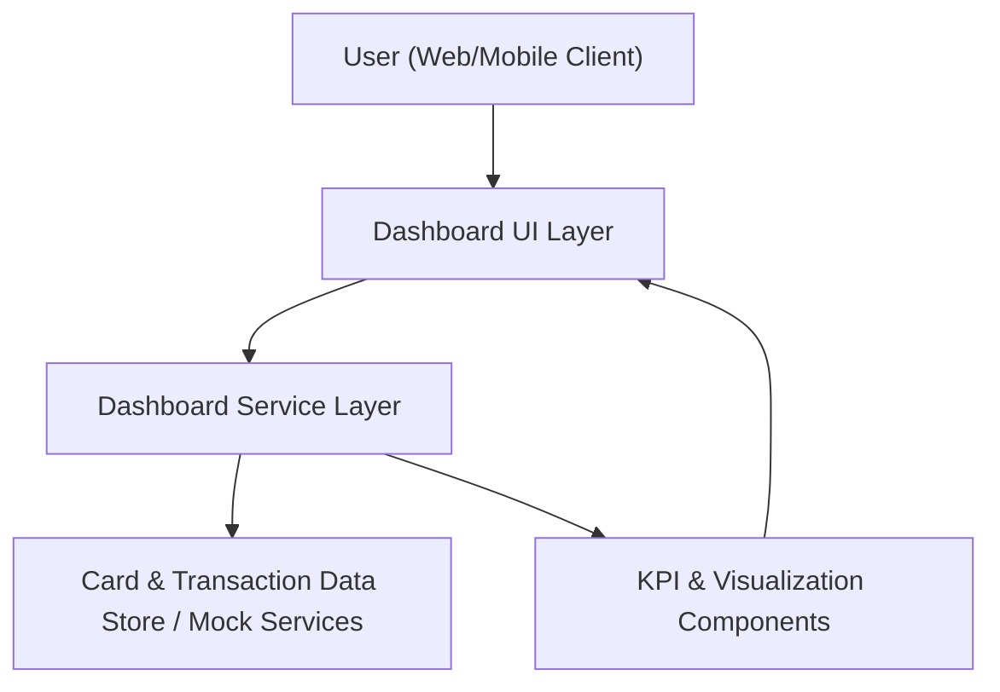

#### 1. High-Level Design
- Summary: Deliver a modern, responsive dashboard that consolidates all user credit cards and key financial indicators (monthly spend, total credit limit, available credit, outstanding amounts) into a single, intuitive interface for monitoring overall credit exposure and financial standing.

- Component Flow:

- Integration Points:
  - Internal card data sources or mock data services providing card details, balances, limits, and transactions.
  - Front-end charting/UI component libraries used to render KPIs and summary tiles.

- Key Assumptions:
  - Card and transaction data is sourced from internal/mock services only, with no live connection to external banks or issuers.
  - KPI computation cadence (e.g., on page load and on demand refresh) is aligned with UI interaction patterns and does not require strict real-time streaming.

- NFR Highlights:
  - Dashboard must be responsive across modern web and mobile browsers, with KPI calculations updating within acceptable UI latency and avoiding exposure of unnecessary sensitive card information.

- Data Flow:
  - The user accesses the dashboard via a web or mobile client, which loads the Dashboard UI Layer.
  - The UI invokes the Dashboard Service Layer to fetch consolidated card and transaction data from internal/mock data stores.
  - The service layer computes KPIs (monthly spend, total credit limit, available credit, outstanding amounts) and structures them for presentation.
  - KPI and visualization components render these values and summaries in the UI, providing a consolidated, responsive view of all credit cards and related metrics.

#### 2. Validation Report
- Requirements Coverage: The design supports a responsive dashboard UI, displays multiple credit cards, computes and presents monthly spend, total credit limit, available credit, and outstanding amount KPIs, and provides a consolidated summary view using internal/mock data sources and charting components, in line with the epic’s described scope and non-functional constraints.