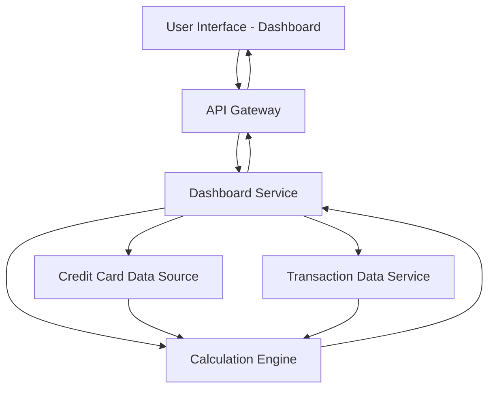

#### 1. High-Level Design

- **Summary**: This epic delivers a consolidated credit card dashboard that displays key performance indicators (KPIs) across multiple credit cards. Users can view monthly spend, total credit limit, available credit, and outstanding amounts in a single responsive interface, enabling real-time financial health monitoring and informed decision-making.

- **Component Flow**:

- **Integration Points**: 
  - **Upstream**: Credit card data source (provides card details, credit limits, and current balances)
  - **Upstream**: Transaction data service (provides transaction history for monthly spend calculations)
  - **Downstream**: User Interface layer (consumes aggregated KPI data for visualization)

- **Key Assumptions**: 
  - Credit card data source provides real-time or near-real-time balance updates via REST API
  - Monthly spend is calculated based on current calendar month transactions aggregated by the calculation engine

- **NFR Highlights**: Dashboard must load within 2 seconds; system must support responsive design across desktop and mobile devices; data refresh rate should be near real-time for accurate financial tracking

- **Data Flow**: User requests dashboard → API Gateway authenticates and routes request → Dashboard Service fetches card details from Credit Card Data Source and transaction data from Transaction Data Service → Calculation Engine aggregates data to compute KPIs (monthly spend, available credit, outstanding amounts) → Aggregated KPI data returned to Dashboard Service → Response sent through API Gateway to User Interface → Dashboard renders KPIs with responsive layout for user viewing

#### 2. Validation Report

- **Requirements Coverage**: The design fully covers the epic's stated scope including dashboard KPIs display, monthly spend tracking, total credit limit view, available credit calculation, outstanding amount display, multiple credit cards view, and responsive layout design. All NFRs (2-second load time, responsive design, near real-time data refresh) are addressed through the architecture with dedicated calculation engine for performance and API Gateway for efficient data retrieval. The design explicitly excludes out-of-scope items (real bank integration, card payments, fund transfers, loans, payment gateway integration) as specified in the epic.