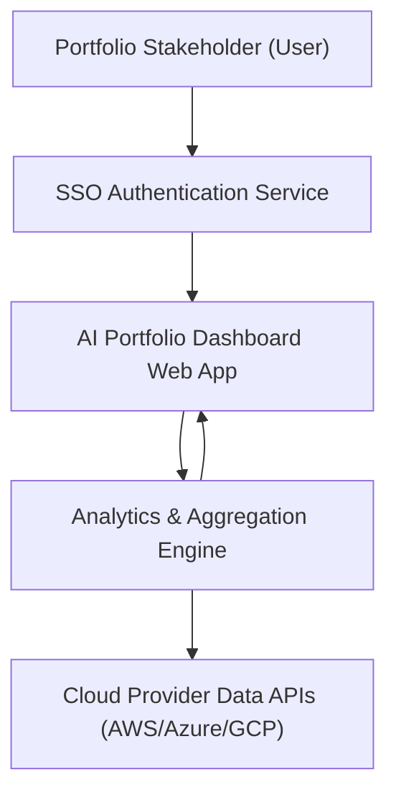

#### 1. High-Level Design
- Summary: Deliver a cloud-based AI portfolio dashboard that aggregates, visualizes, and analyzes AI usage and spend across portfolio companies, enabling portfolio-wide visibility, benchmarking, drill-down analytics, and cost-optimization scenario simulation.

- Component Flow:

- Integration Points:
  - APIs and data access from AWS, Azure, and GCP AI services for usage and spend data.
  - Existing SSO provider for user authentication.
  - Industry benchmarking data sources where available.
  - Synthetic performance monitoring tools for load time measurement.

- Key Assumptions:
  - Cloud provider APIs expose standardized metrics for AI usage and spend that can be queried on at least an hourly basis.
  - Portfolio companies provide and maintain necessary cloud access credentials/permissions via a secure configuration interface.

- NFR Highlights:
  - Must support up to 200 portfolio companies and 1,000 concurrent users, with dashboard pages loading within 3 seconds for 95% interactions, 99.5% uptime, encrypted data in transit (TLS 1.2+) and at rest (AES-256), and WCAG 2.1 AA accessibility compliance.

- Data Flow:
  - Inputs: Authenticated users access the dashboard via SSO; the analytics engine periodically ingests AI usage and spend data from AWS, Azure, GCP APIs and benchmarking sources.
  - Processing: The analytics engine aggregates data across portfolio companies, computes portfolio-level KPIs, benchmarks against industry data, calculates AI ROI, and runs scenario simulations for vendor consolidation and cost savings.
  - Outputs: The dashboard web app renders portfolio-level views, company drill-down analytics, benchmarking graphs, executive summaries, alerts for budget thresholds and data freshness, and exports (PDF/Excel) for board and investor reporting.

#### 2. Validation Report
- Requirements Coverage: The design covers real-time aggregation of AI usage/spend, portfolio and company-level analytics, benchmarking, executive summaries, data freshness indicators, configurable alerts, customizable widgets/views, and scenario simulation for vendor consolidation and cost savings, aligned with the epic’s described scope and non-functional requirements.