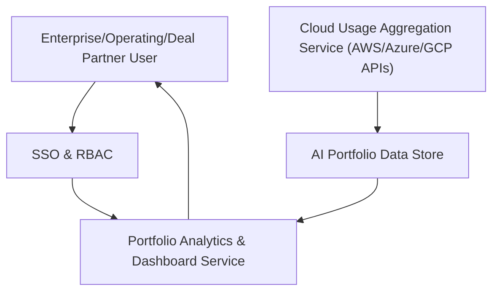

#### 1. High-Level Design
- Summary: Centralized, cloud-based dashboard that aggregates AI usage and spend data from AWS, Azure, and GCP across all portfolio companies, providing real-time visibility, anomaly detection, benchmarking, and drill-down analytics to department/project level, with exportable executive views.

- Component Flow:

- Integration Points:
  - Cloud provider APIs from AWS, Azure, and GCP AI services for usage and spend aggregation.
  - Existing SSO solutions for user authentication and access control.
  - Industry benchmark data sources, if used for comparisons in benchmarking views.
  - Internal logging and monitoring systems for performance and uptime metrics.

- Key Assumptions:
  - Cloud provider APIs expose sufficient usage and spend granularity to support company-, department-, and project-level analytics.
  - Data aggregation jobs are scheduled at least daily to support “real-time” views and data freshness indicators.

- NFR Highlights:
  - Must support up to 200 portfolio companies and 1,000 concurrent users with dashboard pages loading within 3 seconds for 95% of interactions, with TLS 1.2+ and AES-256 encryption, RBAC, audit logging, WCAG 2.1 AA accessibility, and 99.5% uptime with automated failover and daily backups.

- Data Flow:
  - Inputs: Usage and spend metrics are pulled securely from AWS, Azure, and GCP APIs and any benchmark data sources.
  - Processing: Aggregation service normalizes and consolidates data into the portfolio data store, calculates anomalies, trends, benchmarks, freshness indicators, and executive summary metrics (AI ROI, cost savings).
  - Outputs: Dashboard service exposes consolidated portfolio views, drill-down analytics, customizable widgets, data freshness alerts, missing/old data notifications, and exportable PDF/Excel reports to authorized users via SSO-secured access.

#### 2. Validation Report
- Requirements Coverage: The proposed design covers the epic’s scope by aggregating cloud usage and spend data across providers, supporting real-time portfolio views, anomaly and trend detection, benchmarking, drill-down analytics, data freshness notifications, customizable dashboards, executive summaries, and PDF/Excel export, while aligning with stated NFRs and dependencies.