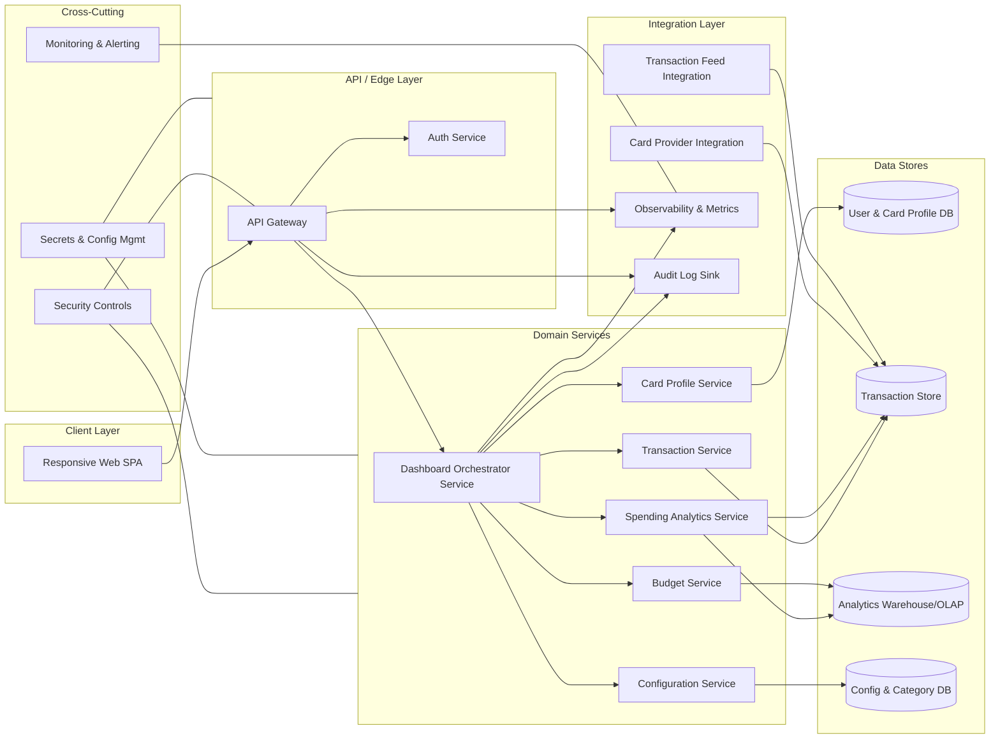

# High-Level Design (HLD) – QE-4845 – Monthly Spending Summary Dashboard V1

## 1. Architecture Overview

The Monthly Spending Summary Dashboard is a multi-channel, read‑heavy analytical application that surfaces credit card spending metrics, card details, transaction history, and budgeting insights. The architecture is composed of:

- **Client Layer** – Responsive web UI (and optionally mobile web) built as a single-page application (SPA) supporting desktop, tablet, and mobile layouts.
- **API / Edge Layer** – Secure REST/GraphQL APIs fronted by an API Gateway providing authN/authZ, rate limiting, and request validation.
- **Domain Services Layer** – Microservices handling credit card profile management, transaction aggregation, analytics computations, and budgeting logic.
- **Data Stores Layer** – Separate logical stores for:
  - Card and user profiles.
  - Transaction ledger (immutable event store or transactional DB).
  - Analytics and aggregates (data warehouse or OLAP store).
  - Configuration (categories, budgets, thresholds).
- **Integration Layer** – Adapters to upstream card/transaction providers and downstream observability and audit platforms.
- **Cross‑Cutting Concerns** – Security, compliance, monitoring, logging, configuration, and error handling applied consistently across layers.

### 1.1 Logical Component Diagram (Mermaid)

## 2. Component Descriptions

### 2.1 Client Layer

**Responsive Web SPA**
- Provides dashboard UI for monthly spend summary, utilization percentage, transaction lists, charts, and budgets.
- Implements adaptive layout and responsive design for desktop, tablet, and mobile breakpoints.
- Offers widgets:
  - **Dashboard Summary** (total monthly spend, total credit limit, available credit, outstanding amount, utilization %, number of transactions).
  - **Credit Card Management** (card list with masked card numbers and key attributes).
  - **Transaction Management Table** (sortable, filterable, searchable grid).
  - **Spending Analytics** charts (category-wise, monthly trend, card-wise distribution, category breakdown).
  - **Budget Tracking** (month budget, spend, remaining, utilization %, progress bar).
  - **Recent Transactions widget** (latest 5 transactions).
- Performs client-side input validation for filters (date range, category selection, text search) before invoking APIs.
- Does not store or display any full card numbers or sensitive PII; uses masked identifiers only.

### 2.2 API / Edge Layer

**API Gateway**
- Single entry point for all client requests.
- Performs request routing to domain services, throttling, rate limiting, and request/response normalization.
- Enforces TLS termination and forwards identity tokens to services.
- Applies coarse-grained RBAC based on user roles (e.g., regular user vs. admin/reporting).

**Auth Service**
- Handles authentication via OAuth2/OIDC (e.g., corporate IdP).
- Issues JWT access tokens with scopes for accessing dashboard and analytics APIs.
- Manages session lifecycles, token refresh, and logout.
- Does not manage upstream card-provider authentication which is treated as out-of-scope for user-facing flows.

### 2.3 Domain Services Layer

**Dashboard Orchestrator Service**
- Main façade for the SPA; aggregates data from card, transaction, analytics, and budget services.
- Provides endpoints:
  - `/dashboard/summary` – returns monthly spend, limits, utilization %, outstanding amount, transactions count.
  - `/dashboard/cards` – paginated list of user’s cards with masked identifiers.
  - `/dashboard/transactions` – filtered transaction list.
  - `/dashboard/analytics` – category, trend, and card distribution metrics.
  - `/dashboard/budget` – budget utilization and progress data.
  - `/dashboard/recent-transactions` – latest N transactions (e.g., 5).
- Performs orchestration but delegates business rules to dedicated services.

**Card Profile Service**
- Manages user’s credit card metadata, excluding any card issuance, KYC, or payment settlement flows (out of scope).
- Stores card attributes: card name, issuing bank, masked card number (no full PAN), credit limit, available credit, current outstanding, billing date, due date.
- Exposes APIs:
  - `/cards` – list and retrieval.
  - `/cards/{id}` – details.
- Enforces that card identifiers exposed to client are tokenized or masked; full PAN or CVV are explicitly out of scope.

**Transaction Service**
- Manages normalized transaction records from upstream feeds.
- Attributes: transaction date, merchant name (normalized), category, card used (card reference), amount, payment status, remarks.
- Supports query APIs with server-side filtering and pagination:
  - By merchant, category, bank, card, date range.
  - Sorting by amount and date.
- Provides data to Analytics Service and Dashboard Orchestrator.
- Does not perform payment authorization/settlement; that is out of scope.

**Spending Analytics Service**
- Performs analytical computations over transactions:
  - Category-wise spending aggregates.
  - Monthly spending trends.
  - Card-wise spending distribution.
  - Category breakdown across predefined categories (Food & Dining, Fuel, Shopping, Travel, Entertainment, Utilities, Healthcare, Education, Miscellaneous).
- Uses pre-computed aggregates in ANALYTICDB for performance, with batch jobs or streaming updates from TXNDB.
- Applies business logic for category mapping and ensures data consistency between categories and configuration service.

**Budget Service**
- Manages user budgets per period (monthly) and per category if required.
- Computes current spend, remaining budget, and budget utilization %.
- Serves data for progress bars and alerts.
- Budget configuration changes and advanced budgeting strategies (multi-month planning, recommendations) are out of scope unless explicitly defined.

**Configuration Service**
- Manages reference data:
  - Categories and their hierarchy.
  - Bank and card configuration metadata.
  - Thresholds for utilization (e.g., high utilization warning).
- Provides APIs for front-end to retrieve category lists and for backend analytics to reference categories.

### 2.4 Data Stores Layer

**User & Card Profile DB (USERDB)**
- Relational store for user-to-card mappings and card attributes.
- Ensures card numbers are stored in masked or tokenized form.
- Indexes by user ID and card reference IDs for fast retrieval.

**Transaction Store (TXNDB)**
- Append-only transaction ledger.
- Stores transaction attributes required for the dashboard.
- Partitioned by user, card, and time for efficient queries.
- Maintains referential integrity to card references, not to PAN.

**Analytics Warehouse/OLAP (ANALYTICDB)**
- Columnar or OLAP store optimized for aggregations and trend analysis.
- Holds derived metrics per category, per card, per month.
- Updated via ETL or streaming ingestion from TXNDB.

**Config & Category DB (CFGDB)**
- Simple relational or key-value store for configuration values and category definitions.
- Supports versioning of category schemes.

### 2.5 Integration Layer

**Card Provider Integration**
- Responsible for ingesting card profile updates (credit limit changes, billing cycles) from upstream systems.
- Runs as scheduled or event-driven jobs that update USERDB.
- Full lifecycle of card issuance and payment processing remains out of scope.

**Transaction Feed Integration**
- Ingests transaction events from external card processor or core banking systems.
- Normalizes raw transactions into the internal schema and persists them to TXNDB.
- Ensures idempotent processing to avoid duplicate entries.

**Observability & Metrics Integration**
- Pushes metrics (API latency, error rates, dashboard load times) to a monitoring system.

**Audit Log Sink**
- Persists audit records for access to dashboard, card views, and sensitive filters.

### 2.6 Cross-Cutting Concerns

**Security Controls**
- End-to-end TLS on all external connections.
- JWT-based authorization with scopes.
- Input validation at API Gateway and services.

**Secrets & Configuration Management**
- Centralized secret store for DB credentials and integration keys.

**Monitoring & Alerting**
- Standard metrics, logs, traces; alerts on SLA breaches.

## 3. Integration Points & Data Flows

### 3.1 Flow 1 – Authentication & Session Establishment

1. User accesses the Web SPA from browser.
2. SPA redirects to Auth Service (via API Gateway) for login using OIDC/OAuth2.
3. User authenticates with IdP; Auth Service issues JWT access token.
4. SPA stores token in secure storage (e.g., HTTP-only cookie) and uses it for subsequent API calls.

**Scope Traceability:**
- Indirectly supports all dashboard features by securing access; not directly mapped to any single bullet but foundational for all displays.

### 3.2 Flow 2 – Dashboard Summary Retrieval

1. SPA calls `/dashboard/summary` on API Gateway with user token.
2. API Gateway validates JWT and forwards to Dashboard Orchestrator.
3. Dashboard Orchestrator queries:
   - Card Profile Service for credit limits and outstanding amounts.
   - Transaction Service for monthly spending totals and transaction counts.
4. Services read from USERDB and TXNDB, apply business logic for month boundaries.
5. Dashboard Orchestrator aggregates:
   - Total monthly spend.
   - Total credit limit.
   - Available credit.
   - Outstanding amount.
   - Utilization % (spend vs limit or outstanding vs limit).
   - Number of transactions.
6. Response is returned via API Gateway to SPA; SPA renders dashboard summary widget.

**Scope Items Covered:**
- Dashboard Summary.
- Total Monthly Spend.
- Total Credit Limit.
- Available Credit.
- Outstanding Amount.
- Utilization Percentage.
- Number of Transactions.

### 3.3 Flow 3 – Credit Card Management View

1. SPA calls `/dashboard/cards` to fetch card list.
2. API Gateway forwards to Dashboard Orchestrator after validation.
3. Dashboard Orchestrator calls Card Profile Service.
4. Card Profile Service reads card records from USERDB and returns attributes:
   - Card name.
   - Issuing bank.
   - Masked card number.
   - Credit limit.
   - Available credit.
   - Current outstanding.
   - Billing date.
   - Due date.
5. Dashboard Orchestrator returns normalized list to SPA.
6. SPA renders card management section in a responsive layout (cards or grid) across devices.

**Scope Items Covered:**
- Credit Card Management.
- Display multiple credit cards: Card Name, Issuing Bank, Card Number (masked), Credit Limit, Available Credit, Current Outstanding, Billing Date, Due Date.
- Responsive Design (indirect, via SPA implementation across layouts).

### 3.4 Flow 4 – Transaction Management, Filters & Search

1. User opens transaction table; SPA calls `/dashboard/transactions` with default filters (current month).
2. API Gateway validates and forwards to Dashboard Orchestrator.
3. Dashboard Orchestrator translates client filters (merchant, category, bank, card, date range, sort fields) into query parameters for Transaction Service.
4. Transaction Service builds parameterized queries on TXNDB:
   - Search by merchant.
   - Filter by category, bank, card, date range.
   - Sort by amount and date.
5. TXNDB returns paginated transaction list with: date, merchant name, category, card reference, amount, payment status, remarks.
6. Transaction Service wraps results into DTOs and returns to Dashboard Orchestrator.
7. Dashboard Orchestrator forwards to SPA via API Gateway.
8. SPA renders the responsive table; user interacts with filters and search, which trigger new API calls.

**Scope Items Covered:**
- Transaction Management table.
- Transaction attributes: Transaction Date, Merchant Name, Category, Card Used, Amount, Payment Status, Remarks.
- Search by Merchant.
- Filter by Category.
- Filter by Bank.
- Filter by Card.
- Filter by Date Range.
- Sort by Amount.
- Sort by Date.
- Responsive Design.

### 3.5 Flow 5 – Spending Analytics (Charts & Category Breakdown)

1. User navigates to analytics section; SPA calls `/dashboard/analytics`.
2. API Gateway validates and routes to Dashboard Orchestrator.
3. Dashboard Orchestrator requests from Analytics Service:
   - Category-wise spending aggregates.
   - Monthly spending trend series.
   - Card-wise spending distribution.
   - Category breakdown across predefined categories.
4. Analytics Service reads pre-aggregated metrics from ANALYTICDB, potentially recalculating from TXNDB for near real-time data.
5. Analytics Service returns structured series data.
6. Dashboard Orchestrator passes data to SPA.
7. SPA renders charts (bar, line, pie) for:
   - Category-wise Spending.
   - Monthly Spending Trend.
   - Card-wise Spending Distribution.
   - Category Breakdown (Food & Dining, Fuel, Shopping, Travel, Entertainment, Utilities, Healthcare, Education, Miscellaneous).

**Scope Items Covered:**
- Spending Analytics.
- Category-wise Spending.
- Monthly Spending Trend.
- Card-wise Spending Distribution.
- Category Breakdown with listed categories.

### 3.6 Flow 6 – Budget Tracking & Progress Bar

1. SPA calls `/dashboard/budget` with selected month.
2. API Gateway forwards to Dashboard Orchestrator.
3. Dashboard Orchestrator requests Budget Service for:
   - Monthly budget value.
   - Current spend.
   - Remaining budget.
   - Budget utilization %.
4. Budget Service reads budget configurations from CFGDB and spending aggregates from ANALYTICDB (or TXNDB).
5. Budget Service computes utilization % and states (e.g., under, approaching, exceeded).
6. Dashboard Orchestrator returns results to SPA.
7. SPA visualizes progress bar and budget metrics.

**Scope Items Covered:**
- Budget Tracking.
- Monthly Budget.
- Current Spend.
- Remaining Budget.
- Budget Utilization %.
- Progress Bar.

### 3.7 Flow 7 – Recent Transactions Widget

1. SPA calls `/dashboard/recent-transactions`.
2. API Gateway routes to Dashboard Orchestrator.
3. Dashboard Orchestrator requests Transaction Service for latest N transactions per user (e.g., limit 5 sorted by date desc).
4. Transaction Service queries TXNDB accordingly.
5. Dashboard Orchestrator returns compact transaction list to SPA.
6. SPA renders widget showing latest 5 transactions.

**Scope Items Covered:**
- Recent Transactions Widget.
- Show latest 5 transactions.

### 3.8 Flow 8 – Observability & Audit

1. Each API call through API Gateway emits structured logs and metrics to Observability & Metrics Integration.
2. Significant events (login, card view, filter usage) are sent to Audit Log Sink.
3. Monitoring system triggers alerts when error rates or latencies exceed thresholds.

**Scope Items Covered:**
- Indirectly supports “enterprise-grade” and operational requirements implied by responsiveness and multi-device support.

## 4. Security & Compliance Features

### 4.1 Transport Security
- All external communication between client and API Gateway is over HTTPS with modern TLS versions.
- Internal service-to-service communication is secured using mTLS where possible.

### 4.2 Data Encryption
- At rest encryption on USERDB, TXNDB, ANALYTICDB, CFGDB using platform-native encryption.
- Encryption of any tokens or identifiers used in card references.
- Card numbers stored only in masked/tokenized form; full PAN and CVV are not stored by this system (explicit boundary).

### 4.3 Input Validation
- API Gateway validates request sizes, content type, and basic schema.
- Services perform validation for filter fields (date range, sort keys, categories) to prevent injection in queries.
- Transaction queries are parameterized to avoid SQL injection.

### 4.4 Output Filtering
- UI and APIs never expose full card numbers, CVVs, or sensitive PII.
- Masked card numbers are generated server-side to avoid leakage.
- Error messages are generic and do not leak internal implementation details.

### 4.5 RBAC / ABAC
- Role-based access at API Gateway: standard users may only access their own cards and transactions.
- Attribute-based checks in domain services ensure user ID in token matches user ID in data queries.
- Administrative/reporting access to aggregated analytics may be restricted by role.

### 4.6 Audit Logging
- Audit Log Sink captures:
  - User login and logout events.
  - Access to card list and transaction views.
  - Changes to budget configurations.
- Logs are immutable and time-stamped for traceability.

### 4.7 Secrets Management
- All credentials for databases and integrations stored in a central secret manager.
- Rotation policies enforced for keys and certificates.

### 4.8 Compliance Mapping
- While the dashboard operates on card-related data, it is designed to avoid direct handling of payment card primary account numbers, CVV, and magnetic stripe data.
- Compliance with card-data regulations (e.g., PCI DSS) is considered at the boundary:
  - This system consumes tokenized/masked card identifiers from upstream compliant systems.
  - Logging and monitoring ensure no sensitive card data appears in logs.

## 5. Resiliency & Error Handling

### 5.1 Retry Mechanisms
- API Gateway retries idempotent requests to downstream services on transient network failures.
- Transaction Feed and Card Provider integrations implement exponential backoff retries when upstream systems are unavailable.

### 5.2 Circuit Breakers & Timeouts
- Per-service circuit breakers to prevent cascading failures when a dependency is unhealthy.
- Timeouts configured at API Gateway and within domain services for external calls.

### 5.3 Graceful Degradation
- If Analytics Service is unavailable, dashboard still shows raw transaction lists and card information, while displaying a message that charts are temporarily unavailable.
- If Budget Service is down, existing budget values may be cached, or the section is hidden with a notice.
- Recent Transactions widget falls back to a smaller dataset or cached view when TXNDB is degraded.

### 5.4 Error Handling & Safe Exposure
- Standardized error response format (error code, message, correlation ID).
- Mapping examples:
  - `400 Bad Request` – invalid filters or date ranges; message explains the field error without exposing internal query details.
  - `401 Unauthorized` – missing/invalid token; user prompted to log in.
  - `403 Forbidden` – attempting to access another user’s data; generic “access denied” message.
  - `404 Not Found` – card or transaction not found; non-sensitive explanation.
  - `500 Internal Server Error` – unexpected conditions; logs contain detail, client sees generic error.
- Correlation IDs propagated from API Gateway through services for traceability.

### 5.5 Observability
- Metrics: request counts, latency, error rates per endpoint.
- Logs: structured JSON logs with user ID (or pseudonymized ID), endpoint, filters used, and outcome.
- Traces: distributed tracing across API Gateway, Dashboard Orchestrator, and downstream services.

## 6. Validation Report

### 6.1 Requirements Coverage

Each Scope (High Level) item from the Epic is mapped to components and flows.

1. **Dashboard Summary**
   - Components: Dashboard Orchestrator, Card Profile Service, Transaction Service, Responsive Web SPA.
   - Flows: Flow 2 – Dashboard Summary Retrieval.

2. **Total Monthly Spend**
   - Components: Transaction Service, TXNDB, Dashboard Orchestrator, SPA.
   - Flows: Flow 2 – Dashboard Summary Retrieval.

3. **Total Credit Limit**
   - Components: Card Profile Service, USERDB, Dashboard Orchestrator, SPA.
   - Flows: Flow 2 – Dashboard Summary Retrieval.

4. **Available Credit**
   - Components: Card Profile Service, USERDB, Dashboard Orchestrator.
   - Flows: Flow 2 – Dashboard Summary Retrieval.

5. **Outstanding Amount**
   - Components: Card Profile Service, USERDB, Dashboard Orchestrator.
   - Flows: Flow 2 – Dashboard Summary Retrieval.

6. **Utilization Percentage**
   - Components: Dashboard Orchestrator, Card Profile Service, Transaction Service.
   - Flows: Flow 2 – Dashboard Summary Retrieval.

7. **Number of Transactions**
   - Components: Transaction Service, TXNDB, Dashboard Orchestrator.
   - Flows: Flow 2 – Dashboard Summary Retrieval.

8. **Credit Card Management (Display multiple credit cards)**
   - Components: Card Profile Service, USERDB, Dashboard Orchestrator, SPA.
   - Flows: Flow 3 – Credit Card Management View.

9. **Card attributes (Card Name, Issuing Bank, Masked Card Number, Credit Limit, Available Credit, Current Outstanding, Billing Date, Due Date)**
   - Components: Card Profile Service, USERDB.
   - Flows: Flow 3 – Credit Card Management View.

10. **Transaction Management Table**
    - Components: Transaction Service, TXNDB, Dashboard Orchestrator, SPA.
    - Flows: Flow 4 – Transaction Management, Filters & Search.

11. **Transaction attributes (Transaction Date, Merchant Name, Category, Card Used, Amount, Payment Status, Remarks)**
    - Components: Transaction Service, TXNDB.
    - Flows: Flow 4 – Transaction Management, Filters & Search.

12. **Search by Merchant**
    - Components: Transaction Service, TXNDB, SPA.
    - Flows: Flow 4 – Transaction Management, Filters & Search.

13. **Filter by Category**
    - Components: Transaction Service, CFGDB, CFG Service, SPA.
    - Flows: Flow 4 – Transaction Management, Filters & Search.

14. **Filter by Bank**
    - Components: Transaction Service, Card Profile Service, TXNDB.
    - Flows: Flow 4 – Transaction Management, Filters & Search.

15. **Filter by Card**
    - Components: Transaction Service, TXNDB.
    - Flows: Flow 4 – Transaction Management, Filters & Search.

16. **Filter by Date Range**
    - Components: Transaction Service, TXNDB.
    - Flows: Flow 4 – Transaction Management, Filters & Search.

17. **Sort by Amount**
    - Components: Transaction Service, TXNDB.
    - Flows: Flow 4 – Transaction Management, Filters & Search.

18. **Sort by Date**
    - Components: Transaction Service, TXNDB.
    - Flows: Flow 4 – Transaction Management, Filters & Search.

19. **Spending Analytics (Charts)**
    - Components: Analytics Service, ANALYTICDB, SPA.
    - Flows: Flow 5 – Spending Analytics.

20. **Category-wise Spending**
    - Components: Analytics Service, ANALYTICDB.
    - Flows: Flow 5 – Spending Analytics.

21. **Monthly Spending Trend**
    - Components: Analytics Service, ANALYTICDB.
    - Flows: Flow 5 – Spending Analytics.

22. **Card-wise Spending Distribution**
    - Components: Analytics Service, ANALYTICDB.
    - Flows: Flow 5 – Spending Analytics.

23. **Category Breakdown (Food & Dining, Fuel, Shopping, Travel, Entertainment, Utilities, Healthcare, Education, Miscellaneous)**
    - Components: Analytics Service, CFG Service, CFGDB.
    - Flows: Flow 5 – Spending Analytics.

24. **Budget Tracking**
    - Components: Budget Service, ANALYTICDB, CFGDB, SPA.
    - Flows: Flow 6 – Budget Tracking & Progress Bar.

25. **Monthly Budget**
    - Components: Budget Service, CFGDB.
    - Flows: Flow 6 – Budget Tracking & Progress Bar.

26. **Current Spend**
    - Components: Budget Service, ANALYTICDB.
    - Flows: Flow 6 – Budget Tracking & Progress Bar.

27. **Remaining Budget**
    - Components: Budget Service, ANALYTICDB.
    - Flows: Flow 6 – Budget Tracking & Progress Bar.

28. **Budget Utilization %**
    - Components: Budget Service.
    - Flows: Flow 6 – Budget Tracking & Progress Bar.

29. **Progress Bar**
    - Components: SPA, Budget Service.
    - Flows: Flow 6 – Budget Tracking & Progress Bar.

30. **Recent Transactions Widget (latest 5 transactions)**
    - Components: Transaction Service, TXNDB, Dashboard Orchestrator, SPA.
    - Flows: Flow 7 – Recent Transactions Widget.

31. **Responsive Design (Mobile/Tablet/Desktop)**
    - Components: Responsive Web SPA.
    - Flows: All user-facing flows (2–7) render through responsive layouts.

### 6.2 Compliance Status

- **Transport Security** – **Pass**
  - TLS enforced at API Gateway; internal mTLS where applicable.

- **Data Encryption at Rest** – **Pass-with-conditions**
  - Assumes platform support for DB encryption and key management; must be validated and configured in target environment.

- **Input Validation & Output Filtering** – **Pass**
  - Validation for filter parameters; no exposure of sensitive card data or internals.

- **RBAC/ABAC** – **Pass-with-conditions**
  - Model is defined, but concrete role definitions and policy enforcement in API Gateway and Auth Service must be implemented.

- **Audit Logging** – **Pass-with-conditions**
  - Design includes audit sink; retention period, access control to logs, and reporting must be finalized.

- **Secrets Management** – **Pass**
  - Central secret store assumed; operational procedures must be followed.

- **Card Data Compliance (e.g., PCI DSS boundary)** – **Pass-with-conditions**
  - Design avoids storing PAN/CVV and relies on upstream compliant tokenization; formalization of data classification and DLP controls is required.

### 6.3 Identified Ambiguities / Risks

1. **Ambiguity/Risk: Definition of Monthly Spend Period**
   - **Consequence if Unresolved:** Inconsistent reporting when billing cycles differ from calendar months; users may see unexpected totals.
   - **Mitigation:** Define a standard period (billing cycle vs calendar month) per card and expose this in configuration; ensure Dashboard Orchestrator uses consistent logic and clearly labels periods in the UI.

2. **Ambiguity/Risk: Category Mapping Rules**
   - **Consequence if Unresolved:** Transactions may appear under incorrect categories, skewing analytics and budget tracking.
   - **Mitigation:** Establish deterministic category mapping rules and maintain them in Configuration Service; version category schemes and provide migration guidance.

3. **Ambiguity/Risk: Budget Granularity (Global vs Per-Category)**
   - **Consequence if Unresolved:** Users may misinterpret budget utilization when budgets are defined at different levels.
   - **Mitigation:** Clearly define supported budget granularity (per-month global, per-category) and reflect this in Budget Service design and UI labels.

4. **Ambiguity/Risk: Upstream Integration SLAs**
   - **Consequence if Unresolved:** Delays in transaction or card data ingestion may cause dashboard to show outdated information.
   - **Mitigation:** Define SLAs with upstream providers; implement metadata in UI indicating data freshness (e.g., “updated X minutes ago”).

5. **Ambiguity/Risk: Scope Boundary for Payment & Settlement**
   - **Consequence if Unresolved:** Users might expect to be able to pay bills or manage disputes directly from the dashboard.
   - **Mitigation:** Explicitly document that payment and settlement flows are out of scope; if future epics add these capabilities, treat them as separate services and integrate via clear navigation and APIs.

6. **Ambiguity/Risk: Multi-Device Performance Expectations**
   - **Consequence if Unresolved:** On low-powered mobile devices, heavy analytics queries and complex charts may cause poor responsiveness.
   - **Mitigation:** Define performance budgets; implement pagination, lazy loading for analytics, and device-aware UI simplifications.

7. **Ambiguity/Risk: Data Retention & Privacy Policies**
   - **Consequence if Unresolved:** Unclear retention rules could conflict with regulatory or organizational policies.
   - **Mitigation:** Align TXNDB and ANALYTICDB retention and archival policies with corporate governance; enforce automatic purging or anonymization as required.
