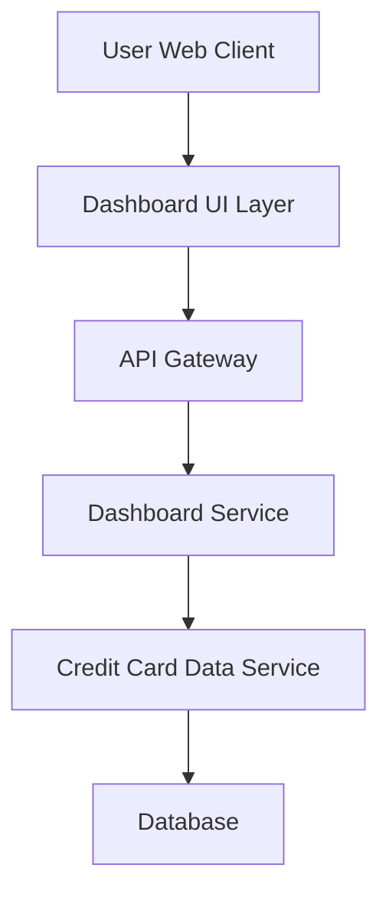

#### 1. High-Level Design

- **Summary**: This epic delivers a consolidated dashboard that displays key performance indicators (KPIs) for users' credit card portfolios. The dashboard shows monthly spend, total credit limit, available credit, and outstanding amounts across all credit cards in a modern, responsive interface. The solution provides users with instant visibility into their overall credit card financial health.

- **Component Flow**:

- **Integration Points**: 
  - **Upstream**: Credit Card Data Service (provides card balances and transaction data)
  - **Downstream**: Database layer for persistent storage of card and transaction information

- **Key Assumptions**: 
  - KPI calculations (available credit, outstanding amount) are performed server-side by the Dashboard Service based on real-time data from the Credit Card Data Service.
  - Monthly spend is calculated based on transaction data aggregated for the current calendar month.

- **NFR Highlights**: Dashboard must support responsive design across desktop, tablet, and mobile devices; Page load time must be optimized for quick KPI rendering.

- **Data Flow**: User requests dashboard → API Gateway authenticates and routes request → Dashboard Service fetches card data from Credit Card Data Service → Credit Card Data Service retrieves balances and transactions from Database → Dashboard Service aggregates and calculates KPIs (monthly spend, total credit limit, available credit, outstanding amount) → Dashboard UI renders KPIs in responsive layout → User views consolidated financial snapshot.

#### 2. Validation Report

- **Requirements Coverage**: The design fully covers the epic's stated scope including dashboard interface, monthly spend display, total credit limit tracking, available credit calculation, outstanding amount monitoring, and responsive layout design. The component architecture supports the NFR requirements for responsive design and optimized page load times through separation of concerns and efficient data retrieval patterns. Integration with the Credit Card Data Service satisfies the stated dependency requirement.